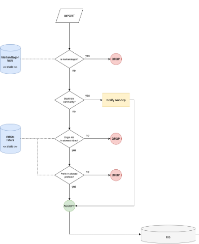
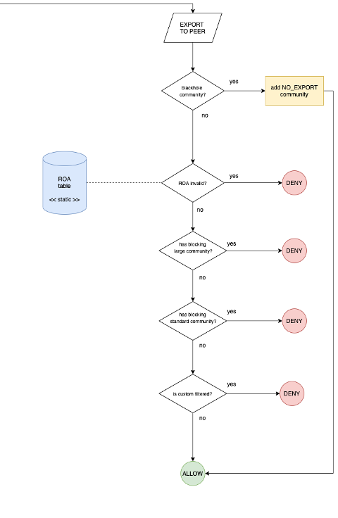

# Mutually Agreed Norms for Routing Security (MANRS) Implementation Guide

# MANRS is an important step toward a globally robust and secure routing infrastructure

Mutually Agreed Norms for Routing Security (MANRS) is an initiative to greatly improve the security and resilience of the Internet's global routing system. It does this by encouraging those running BGP to implement well-established industry best practices and technological solutions that can address the most common threats.

MANRS was initially targeted at network operators, but Internet Exchange Points (IXPs) should also play an active role in protecting the Internet. IXPs represent active communities with common operational objectives and already contribute to a more secure and resilient Internet infrastructure.

MANRS can help IXPs build safe neighborhoods through the MANRS Actions. It also demonstrates an IXP's commitment to improving security, developing a culture of collective responsibility, and building a responsible community.

MANRS has the following objectives:

-   Raise awareness of routing security problems and encourage the implementation of actions that can address them;
    
-   Promote a culture of collective responsibility toward the security and resilience of the Internet's global routing system;
    
-   Demonstrate the ability of the Internet industry to address routing security problems;
    
-   Provide a framework to better understand and address issues relating to the security and resilience of the Internet's global routing system.

# IXPs are important partners in the MANRS community

IXPs can be a collaborative focal point to discuss and promote the importance of routing security. To address the unique needs and concerns of IXPs, the community created a separate set of MANRS actions for IXP participants.

# Eligibility criteria and proof of implementation

To join, an IXP must demonstrate commitment by implementing at least three out of the five IXP Program Actions. Actions 1 and 2 are mandatory, and the IXP must implement at least one additional Action.

The implementation of specific Actions should be reflected in relevant documentation (e.g. IXP policies, technical briefs, etc.). This
documentation should be publicly available, or at least available for the IXP's members. When joining MANRS, an IXP will be asked to provide links to this documentation.

# Terms used in this document

**IXP member**-- a network operator using interconnection services provided by an IXP. Depending on the IXP model that may be an IXP
member, an IXP customer, etc.

**Blackhole community** - Blackhole community (65535:666) is the BGP community used to implement the RTBH (Remote-Triggered Black-Hole) mechanism. This mechanism is used by Route Servers to divert the flow of malicious data toward a specific next-hop.

**Internet Routing Registry (IRR)** - a database of Internet route (IRRDB) objects for determining and sharing routes and related
information used for configuring routers, with a view to facilitate the exchange of routing information between Internet service providers. The objects are specified in [RPSL](https://tools.ietf.org/html/rfc2622) format.

**RPKI (Resource Public Key Infrastructure)** - proves the association between specific IP address blocks or ASNs and the holders of those Internet number resources. The certificates are proof of the resource holder\'s right of use of their resources and can be validated
cryptographically.

**ROA (Route Origin Authorization) -** the key object of the RPKI architecture. They can be seen as an object that authorizes an AS to
announce a specific IP prefix. The validation process of a BGP announcement is based on the comparison between the information
contained in the announcement, and the ROAs present in the database of the router itself, downloaded from the RPKI Validator. There are 3 possible results from the validation process:

-   **Valid**: RPKI Validator contains a ROA with the same ASN, and the length of the prefix netmask updated is \<= of the max length
    specified in the ROA.
    
-   **Invalid**: RPKI Validator contains a ROA but either it has a different ASN or the netmask length is \> than the one specified in
    the ROA.
    
-   **Not found:** within RPKI Validator there are no ROAs matching the update.

**Route Servers (RS)** - typically used on shared access media networks, such as IXPs, to facilitate simplified interconnection between multiple Internet routers. They are a value-added service offered by IXPs and their popularity has made them critical infrastructure for large IXPs.

**Martian/Bogon** - A "bogon" (plural: "bogons") is a packet with an IP source address in an address block not yet allocated by IANA or the Regional Internet Registries (AFRINIC, APNIC, ARIN, LACNIC, or RIPE) as well as all addresses reserved for private or special use by:
[[RFC1918]](https://tools.ietf.org/html/rfc1918),
[[RFC2544]](https://tools.ietf.org/html/rfc2544),
[[RFC3927]](https://tools.ietf.org/html/rfc3927), 
[[RFC5735]](https://tools.ietf.org/html/rfc5735)
[[RFC5737]](https://tools.ietf.org/html/rfc5737),
[[RFC6598]](https://tools.ietf.org/html/rfc6598) and
[[RFC6890]](https://tools.ietf.org/html/rfc6890).
Unallocated addresses are blocks of public address space that have not been allocated by IANA to the RIRs yet, but that could be allocated in the future.

**MANRS IXP Program (MANRS IXPP) participant**-- an IXP participating in the MANRS IXP Program.

# The IXP Program Action Set

## Action 1. Prevent propagation of incorrect routing information. (Mandatory)

The IXP implements filtering of route announcements at the Route Server based on routing information data (IRR and/or RPKI). Based on the outcome of the validation process, the invalid announcements are filtered in accordance with the IXP's published policy. IRR-based filtering is applied on updates from peers, and strict filtering of RPKI invalids in the export phase. As IRR and RPKI information are completely independent, the filtering strategy can be modified.

### 1-1 Import filtering

IXPs should perform import filtering on routes received from each peer in their RS infrastructure. Import filtering ensures that prefixes
coming from a certain client are put in the routing information base (RIB) only after having been compared with IRR registered policies for that peer. Thus, only routes originating from the client AS or from one of its registered customers are accepted into the RIB. In any case, sanity checks should be applied to filter out bogon and martian prefixes.

In order to support input filtering, each client should specify, along with its own AS number, an AS-SET macro containing all its direct
customers that are going to be announced on the exchange. Then a set of filter rules is generated by looking at registered routes for the aforementioned AS-SET (client + customers). Each route is filtered by matching the exact netmask and origin AS.

MANRS recommends the following steps for import filtering:

1.  Check if the IP prefix received from the member/customer is a Martian/bogon.

> If the prefix updated by a peer is a Martian/bogon prefix, drop it; else go to step 2.

2.  Check if the update contains the BGP blackhole community

> If the update received has the BGP blackhole community, the Route Server changes the next hop of the update with the one of the server dummies and the prefix is accepted and stored in the RS's RIB; else go to step 3.

3.  Check if the updated prefix origin AS belongs to the set of allowed ASes

> The set of allowed ASes for a given peer is made of its own AS plus any additional AS listed as a customer in a registered AS-SET. If the origin AS of the updated prefix belongs to the allowed set, then go to step 4; else reject the update.

4.  Check if updated prefix belongs to the set of allowed prefixes

> The set of allowed prefixes for a peer is built by expanding any AS included in the corresponding set of allowed ASes for the peer. For any AS in the set, ROUTE objects having that AS as an origin are fetched.
> 
> If the updated prefix exactly matches one of the prefixes included in the set of allowed prefixes, then the prefix is added to the RIB; else it is rejected.

### 1-2 Export filtering

An IXP Route Server infrastructure should implement export filtering on outgoing advertisements. Before the prefixes stored in Route Server's RIB are exported to the peers, export filters are applied. This process applies on a per-neighbor basis.

IXP members should define their policy using RPSL objects in IRR and specify the prefixes they want to send other IXP participants (export policy) as well as from which participants they want to receive updates (import policy).

MANRS recommends the following steps for export filtering:

1.  Check if the update has blackhole BGP community

> If the update has the blackhole BGP community, it applies the "no-export\" BGP community (which tells the peers who will receive the update not to propagate it) and the prefix is announced to the neighbor. If no blackhole BGP community is found for this advertisement, proceed to the next step.

2.  Check if there is a covering ROA in RPKI Validator

> If the result is an invalid announcement, the update is not propagated to the neighbor; else proceed to the next step.

3.  Check if the update has a BGP blocking large community

> If the update has a BGP blocking large community for the specific neighbor, the prefix should not be exported to the neighbors; else proceed to the next step.

4.  Check if the update has a BGP blocking standard community

> If the update has a BGP blocking standard community for the specific neighbor, it should not export the prefix to the neighbor; else proceed to the next step.

5.  Check if the update is custom filtered

> If the update is custom filtered for the specific neighbor, it should not export the prefix to the neighbor; else it is announced to the neighbor.

### 1-3 Examples: Configuring RPKI filtering

Here is an example of how to configure BIRD - a commonly used route server - with Resource Public Key Infrastructure (RPKI) to Router Protocol, or RTR Protocol, to filter invalid routes.

RTR, defined in [RFC 6810](https://datatracker.ietf.org/doc/html/rfc6810) and [RFC 8210](https://datatracker.ietf.org/doc/html/rfc8210), is a protocol that delivers validated prefix origin to routers. BIRD 2.0 supports RTR.

Below is an example of how to configure BIRD to drop invalid routes:

> roa4 table r4;
>roa6 table r6;
> protocol rpki {
>    debug all;
>     roa4 { table r4; };
>    roa6 { table r6; };
> 
>\# Replace the below with your RPKI validator address
>     remote \"192.0.2.100\" port 8282;
>    retry keep 5;
>     refresh keep 30;
>    expire 600;
> }
>
> filter peer_in_v4 {
>    if (roa_check(r4, net, bgp_path.last) = ROA_INVALID) then 
>     {
>        print \"Ignore RPKI invalid \", net, \" for ASN \", bgp_path.last;
>         reject;
>    }
>     accept;
>}
> 
>protocol bgp {
>     debug all;
>    local as 65000;
>     neighbor 192.0.2.11 as 65001;
>    ipv4 {
>         import filter peer_in_v4;
>        export none;
>     };
>}

Here is an example of how to configure openBGPd to drop INVALID routes (static table, no RTR support). After importing the rpki-client
generated configuration:

> roa-set {
>
> 203.119.88.0/23 maxlen 24 source-as 187
>
> 2001:dd8:7::/48 maxlen 48 source-as 187
>
> 2401:680::/32 maxlen 32 source-as 715
>
> }
>
> deny to any ovs invalid

NOTE: the use of "to" in the deny clause (instead of "from") allows you to keep visibility of all INVALID prefixes without reflecting them to all peers (through the command *bgpctl show rib ovs invalid*).

IXPs using a Route Server to facilitate multilateral peerings should use it to validate received route announcements from a peer and subsequently filter them to other peers. Special purpose cases, such as research projects, are out of scope for this requirement.

Validation is usually done by checking BGP announcements against RPKI data (ROA objects or a validated cache) and second IRR data (by resolving the AS-SET object). It is also common to check the announcements against "bogons" or "martians" (IP prefixes as defined in RFC1918, RFC5735, and RFC6598; ASNs in the AS-PATH as defined by RFC5398, RFC6793, RFC6996, RFC7300, RFC7607).

### 1-4 Bogon filtering examples

The below examples are borrowed from: [https://bgpfilterguide.nlnog.net/](https://bgpfilterguide.nlnog.net/guides/reject_invalids/) and cover various router operating systems and how to filter bogon networks:

**[Cisco]{.underline}**

> prefix-set BOGONS_V4
>    0.0.0.0/8 le 32,
>     10.0.0.0/8 le 32,
>    100.64.0.0/10 le 32,
>     127.0.0.0/8 le 32,
>    169.254.0.0/16 le 32,
>     172.16.0.0/12 le 32,
>    192.0.2.0/24 le 32,
>     192.88.99.0/24 le 32,
>    192.168.0.0/16 le 32,
>     198.18.0.0/15 le 32,
>    198.51.100.0/24 le 32,
>     203.0.113.0/24 le 32,
>    224.0.0.0/4 le 32,
>     240.0.0.0/4 le 32
>end-set
> !
>route-policy BGP_FILTER_IN
>     if destination in BOGONS_V4 then
>        drop
>     endif
>end-policy

**[Junos]{.underline}**

> policy-statement reject-bogon-prefixes {
>	term reject-bogon-prefixes-v4 {
> 		from {
>			route-filter 0.0.0.0/8 orlonger;
> 			route-filter 10.0.0.0/8 orlonger;
>			route-filter 100.64.0.0/10 orlonger;
> 			route-filter 127.0.0.0/8 orlonger;
>			route-filter 169.254.0.0/16 orlonger;
> 			route-filter 172.16.0.0/12 orlonger;
>			route-filter 192.0.2.0/24 orlonger;
> 			route-filter 192.88.99.0/24 orlonger;
>			route-filter 192.168.0.0/16 orlonger;
> 			route-filter 198.18.0.0/15 orlonger;
>			route-filter 198.51.100.0/24 orlonger;
> 			route-filter 203.0.113.0/24 orlonger;
>			route-filter 224.0.0.0/4 orlonger;
> 			route-filter 240.0.0.0/4 orlonger;
>		}
> 		then reject;
>	}
> 	term reject-bogon-prefixes-v6 {
>		from {
> 			route-filter ::/8 orlonger;
>			route-filter 100::/64 orlonger;
> 			route-filter 2001:2::/48 orlonger;
>			route-filter 2001:10::/28 orlonger;
> 			route-filter 2001:db8::/32 orlonger;
>			route-filter 2002::/16 orlonger;
> 			route-filter 3ffe::/16 orlonger;
>			route-filter fc00::/7 orlonger;
> 			route-filter fe80::/10 orlonger;
>			route-filter fec0::/10 orlonger;
> 			route-filter ff00::/8 orlonger;
>		}
> 		then reject;
>	}
> }

[OpenBGPD]{.underline}

> deny from any prefix 0.0.0.0/8 prefixlen \>= 8
>
> deny from any prefix 10.0.0.0/8 prefixlen \>= 8
>
> deny from any prefix 100.64.0.0/10 prefixlen \>= 10
>
> deny from any prefix 127.0.0.0/8 prefixlen \>= 8
>
> deny from any prefix 169.254.0.0/16 prefixlen \>= 16
>
> deny from any prefix 172.16.0.0/12 prefixlen \>= 12
>
> deny from any prefix 192.0.2.0/24 prefixlen \>= 24
>
> deny from any prefix 192.88.99.0/24 prefixlen \>= 24
>
> deny from any prefix 192.168.0.0/16 prefixlen \>= 16
>
> deny from any prefix 198.18.0.0/15 prefixlen \>= 15
>
> deny from any prefix 198.51.100.0/24 prefixlen \>= 24
>
> deny from any prefix 203.0.113.0/24 prefixlen \>= 24
>
> deny from any prefix 224.0.0.0/4 prefixlen \>= 4
>
> deny from any prefix 240.0.0.0/4 prefixlen \>= 4

[Bird]{.underline}

> [define BOGON_PREFIXES = \[]{.underline}
>
> [0.0.0.0/8+, \# RFC 1122 \'this\' network]{.underline}
>
> [10.0.0.0/8+, \# RFC 1918 private space]{.underline}
>
> [100.64.0.0/10+, \# RFC 6598 Carrier grade nat space]{.underline}
>
> [127.0.0.0/8+, \# RFC 1122 localhost]{.underline}
>
> [169.254.0.0/16+, \# RFC 3927 link local]{.underline}
>
> [172.16.0.0/12+, \# RFC 1918 private space]{.underline}
>
> [192.0.2.0/24+, \# RFC 5737 TEST-NET-1]{.underline}
>
> [192.88.99.0/24+, \# RFC 7526 6to4 anycast relay]{.underline}
>
> [192.168.0.0/16+, \# RFC 1918 private space]{.underline}
>
> [198.18.0.0/15+, \# RFC 2544 benchmarking]{.underline}
>
> [198.51.100.0/24+, \# RFC 5737 TEST-NET-2]{.underline}
>
> [203.0.113.0/24+, \# RFC 5737 TEST-NET-3]{.underline}
>
> [224.0.0.0/4+, \# multicast]{.underline}
>
> [240.0.0.0/4+ \]; \# reserved]{.underline}
>
> [function reject_bogon_prefixes()]{.underline}
>
> [prefix set bogon_prefixes;]{.underline}
>
> [{]{.underline}
>
> [bogon_prefixes = BOGON_PREFIXES;]{.underline}
>
> [if (net \~ bogon_prefixes) then {]{.underline}
>
> [print \"Reject: Bogon prefix: \", net, \" \", bgp_path;]{.underline}
>
> [reject;]{.underline}
>
> [}]{.underline}
>
> [}]{.underline}
>
> [\...]{.underline}
>
> [filter transit_in {]{.underline}
>
> [reject_invalids();]{.underline}
>
> [reject_bogon_asns();]{.underline}
>
> [reject_bogon_prefixes();]{.underline}
>
> [reject_long_aspaths();]{.underline}
>
> [reject_small_prefixes();]{.underline}
>
> [reject_default_route();]{.underline}
>
> [\...]{.underline}
>
> [honor_graceful_shutdown();]{.underline}
>
> [accept;]{.underline}
>
> [}]{.underline}
>
> [filter ixp_in {]{.underline}
>
> [reject_invalids();]{.underline}
>
> [reject_bogon_asns();]{.underline}
>
> [reject_bogon_prefixes();]{.underline}
>
> [reject_long_aspaths();]{.underline}
>
> [reject_transit_paths()]{.underline}
>
> [reject_small_prefixes();]{.underline}
>
> [reject_default_route();]{.underline}
>
> [\...]{.underline}
>
> [honor_graceful_shutdown();]{.underline}
>
> [accept;]{.underline}
>
> [}]{.underline}

Here is a sample script to fetch bogons from Cymru for use in OpenBGPD:

> #!/usr/bin/env python3
>
> import sys
>import urllib2
> import re
>
> ver = sys.argv\[1\]
>
> url = \"<https://www.team-cymru.org/Services/Bogons/fullbogons-ip>\" + ver + \".txt\"
>
> contents = urllib2.urlopen(url).read()
> 
>for line in contents.splitlines():
> 	if re.match(\"\^#\",line):
>		continue
> 	else:
>		print(\"deny from any prefix \" + line)
> 
>
> 
>BIRD
> 
>#!/usr/bin/env python3
> 
>import sys
> import urllib2
>import re
> 
>ver = sys.argv\[1\]
> 
>url = \"<https://www.team-cymru.org/Services/Bogons/fullbogons-ip>\" + ver + \".txt\"
> 
>contents = urllib2.urlopen(url).read()
> 
>for line in contents.splitlines():
> 	if re.match(\"\^#\",line):
>		continue
> 	else:
> 		print(line + \",\")

## 1-5 Checking that RPKI validation works correctly

Once configured, check that RPKI route origin validation (ROV) works correctly. To perform this task, use the MANRS IXP validation tool. It is an open-source project and the tool is freely available from Github: [[https://github.com/manrs-tools/MANRS-IXP-validation-tool]](https://github.com/manrs-tools/MANRS-IXP-validation-tool).

The purpose of this tool is to validate RPKI filtering on IXP route servers by performing ROV on the routes accepted by the route server.
The tool validates the routes seen in an exported MRT RIB dump, [through the [Alice-LG]{.underline}](https://github.com/alice-lg/alice-lg) API, or [[Bird\'s Eye]{.underline}](https://github.com/inex/birdseye) API,
against RPKI data, to see whether the RIB contains any RPKI invalid routes. If communities are used to tag invalid routes (for instance, to be filtered out on egress), they can be specified, so they will be treated as positive ROV.

**Action 2.  Promote MANRS to the IXP membership.**

**The IXP provides encouragement or assistance for members to implement MANRS Actions. (There are 4 separate check-boxes for different levels of incentives; one or more must be checked.)**

The IXP actively promotes MANRS by encouraging its members to implement the appropriate MANRS Actions:

-   [MANRS Actions for Network Operators](https://www.manrs.org/isps/); and
    
-   [MANRS Actions for CDN and Cloud Providers](https://www.manrs.org/cdn-cloud-providers/).

The encouragement can take different forms:

### Action 2-1: Offer assistance to its members to maintain accurate routing information in an appropriate repository (IRR and/or RPKI)

This may take the form of trainings or tutorials, for example, as part of the onboarding process.

### Action 2-2: Offer assistance in implementing MANRS Network Operator Program Actions for the members

This may take the form of trainings or tutorials, for example, as part of the onboarding process. The MANRS resources page
(<https://manrs.org/resources/>) will have up-to-date materials on MANRS that will be of use to the IXP members.

### Action 2-3: Indicate MANRS participation on the member list and the website

Display the MANRS logo or badge next to the names of the MANRS conformant members on the IXP's website so as to encourage other members to actively pursue MANRS conformance. IXP Manager, a management platform for IXPs, could be used to achieve this via a built-in feature that allows highlighting of MANRS membership on a IXP member's public and internal pages (<https://docs.ixpmanager.org/features/manrs/>).

### Action 2-4: Provide incentives linked to MANRS readiness

This may be a symbolic price reduction or any other benefit with the rationale that a MANRS conformant member will less likely cause issues with other peers and the IXP operations, are easier to coordinate with, etc. therefore reducing the cost of providing the IXP service.

**Action 3. Protect the peering platform.**

**The IXP has a published policy of traffic not allowed on the peering fabric and performs filtering of such traffic.**

The main purpose of the peering platform is to allow IXP members to exchange Internet protocol (IP) traffic between their Autonomous Systems and those of their customers. The only function that routers connected to the IXP should accomplish is to establish BGP peerings and to forward IP traffic. Features that do not perform BGP-related functions that are active on member routers might be not only useless, but potentially dangerous to the operations of the IXP.

Like in all common environments, there must be rules that all should observe to ensure that the IXPs run safely for the benefit of all
participants. While not strictly routing, applying hygiene on Layer 2 can ensure the smooth operation of the platform and contribute to the stability of the IXP infrastructure and routing. Misconfigurations can happen to anybody, so it is usually best to put some protection mechanisms in place on the peering platform, such as the following.

Each port of the peering platform should be filtered on the ethertype field so that only packets with proper payload are allowed:

-   0x0800 -- *IPv4*

-   0x0806 -- *ARP*

-   0x86dd -- *IPv6*

Commonly, filtering applies to:

-   Blocked Ethernet frame formats

-   Blocked Ethertypes

-   Various Link-local protocols, such as IRDP, ICMP redirects, Discovery protocols (CDP, EDP), VLAN/trunking protocols (VTP, DTP), BOOTP/DHCP, etc.

Where possible, it is useful to filter the traffic listed above in order to guarantee high levels of security and robustness to the whole peering platform, and to avoid potential problems to the smooth flow of traffic between members. In general, all protocols that generate broadcast toward the switching infrastructure of the exchange point should be deactivated, with the sole exception of the ARP protocol and of all other protocols necessary for the correct functioning of the exchange
point.

Other recommendations:

-   MAC Address Locking: for each port of the switches used by a member, only one MAC address should be authorized; that MAC address will be associated to the IP addresses used for peering by the member. For each peer connection, the MAC address of its router interface should statically \"locked\" to the switch port where it is connected. All packets coming from other MAC addresses **should be dropped** by the port;
    
-   Storm control: Together with MAC Locking, the IXP should enforce Broadcast Storm Control mechanisms on its switches, in order to prevent an accidentally generated broadcast storm to affect the whole Exchange. As a general rule, on each port the broadcast level is limited to 10% of available bandwidth;
    
-   *Proxy-ARP* on the router's interface should not be allowed. A router configured with Proxy ARP answers to all ARP queries passing through the network, which is dangerous as it could lead to the hijacking of packets destined for other members;
    
-   Disabling bridge control between IXP fabric and customers;

-   Quarantine Vlan: When members join the IXP, their port should be assigned to the Quarantine Vlan where a "dummy" peering is set up. Hence, all new ports are placed there for testing purposes before the member connection is moved into the production environment. Members are moved to the main peering vlan only after all the problems detected on the Quarantine Vlan have been fixed.

### **3-2 Examples: Layer 2 Hardenin**g  Below is an example of layer 2 hardening on Nokia devices

**Nokia Hardening techniques**
Product line: 7250 IXR (MD-CLI)

*L2 protection configuration:*

/configure filter mac-filter \"CUSTOMER X\" description \"MANRS IXP
Action 3: Protect the peering platform\"

/configure filter mac-filter \"CUSTOMER X\" default-action drop

/configure filter mac-filter \"CUSTOMER X\" scope exclusive

/configure filter mac-filter \"CUSTOMER X\" filter-id 100

/configure filter mac-filter \"CUSTOMER X\" entry 10 { description
\"ARP\" }

/configure filter mac-filter \"CUSTOMER X\" entry 10 { match etype 0x806
}

/configure filter mac-filter \"CUSTOMER X\" entry 10 { match src-mac
address XX:XX:XX:XX:XX:XX }

/configure filter mac-filter \"CUSTOMER X\" entry 10 { match src-mac
mask ff:ff:ff:ff:ff:ff }

/configure filter mac-filter \"CUSTOMER X\" entry 10 { action accept }

/configure filter mac-filter \"CUSTOMER X\" entry 20 { description
\"IPv4\" }

/configure filter mac-filter \"CUSTOMER X\" entry 20 { match etype 0x800
}

/configure filter mac-filter \"CUSTOMER X\" entry 20 { match src-mac
address XX:XX:XX:XX:XX:XX }

/configure filter mac-filter \"CUSTOMER X\" entry 20 { match src-mac
mask ff:ff:ff:ff:ff:ff }

/configure filter mac-filter \"CUSTOMER X\" entry 20 { action accept }

/configure filter mac-filter \"CUSTOMER X\" entry 30 { description
\"IPv6 Unicast\" }

/configure filter mac-filter \"CUSTOMER X\" entry 30 { match etype
0x86dd }

/configure filter mac-filter \"CUSTOMER X\" entry 30 { match src-mac
address XX:XX:XX:XX:XX:XX }

/configure filter mac-filter \"CUSTOMER X\" entry 30 { match src-mac
mask ff:ff:ff:ff:ff:ff }

/configure filter mac-filter \"CUSTOMER X\" entry 30 { match dst-mac
address 00:00:00:00:00:00 }

/configure filter mac-filter \"CUSTOMER X\" entry 30 { match dst-mac
mask 01:00:00:00:00:00 }

/configure filter mac-filter \"CUSTOMER X\" entry 30 { action accept }

/configure filter mac-filter \"CUSTOMER X\" entry 40 { description
\"IPv6 Multicast\" }

/configure filter mac-filter \"CUSTOMER X\" entry 40 { match etype
0x86dd }

/configure filter mac-filter \"CUSTOMER X\" entry 40 { match src-mac
address XX:XX:XX:XX:XX:XX }

/configure filter mac-filter \"CUSTOMER X\" entry 40 { match src-mac
mask ff:ff:ff:ff:ff:ff }

/configure filter mac-filter \"CUSTOMER X\" entry 40 { match dst-mac
address 33:33:00:00:00:00 }

/configure filter mac-filter \"CUSTOMER X\" entry 40 { match dst-mac
mask ff:ff:00:00:00:00 }

/configure filter mac-filter \"CUSTOMER X\" entry 40 { action accept }

Product line: 7450 ESS, 7750 SR, and 7950 XRS (MD-CLI)

*L2 protection configuration:*

/configure filter mac-filter \"CUSTOMER X\" description \"MANRS IXP
Action 3: Protect the peering platform\"

/configure filter mac-filter \"CUSTOMER X\" default-action drop

/configure filter mac-filter \"CUSTOMER X\" scope exclusive

/configure filter mac-filter \"CUSTOMER X\" filter-id 100

/configure filter mac-filter \"CUSTOMER X\" entry 10 { description
\"ARP\" }

/configure filter mac-filter \"CUSTOMER X\" entry 10 { match frame-type
ethernet-ii }

/configure filter mac-filter \"CUSTOMER X\" entry 10 { match etype 0x806
}

/configure filter mac-filter \"CUSTOMER X\" entry 10 { match src-mac
address XX:XX:XX:XX:XX:XX }

/configure filter mac-filter \"CUSTOMER X\" entry 10 { match src-mac
mask ff:ff:ff:ff:ff:ff }

/configure filter mac-filter \"CUSTOMER X\" entry 10 { action accept }

/configure filter mac-filter \"CUSTOMER X\" entry 20 { description
\"IPv4\" }

/configure filter mac-filter \"CUSTOMER X\" entry 20 { match frame-type
ethernet-ii }

/configure filter mac-filter \"CUSTOMER X\" entry 20 { match etype 0x800
}

/configure filter mac-filter \"CUSTOMER X\" entry 20 { match src-mac
address XX:XX:XX:XX:XX:XX }

/configure filter mac-filter \"CUSTOMER X\" entry 20 { match src-mac
mask ff:ff:ff:ff:ff:ff }

/configure filter mac-filter \"CUSTOMER X\" entry 20 { action accept }

/configure filter mac-filter \"CUSTOMER X\" entry 30 { description
\"IPv6 Unicast\" }

/configure filter mac-filter \"CUSTOMER X\" entry 30 { match frame-type
ethernet-ii }

/configure filter mac-filter \"CUSTOMER X\" entry 30 { match etype
0x86dd }

/configure filter mac-filter \"CUSTOMER X\" entry 30 { match src-mac
address XX:XX:XX:XX:XX:XX }

/configure filter mac-filter \"CUSTOMER X\" entry 30 { match src-mac
mask ff:ff:ff:ff:ff:ff }

/configure filter mac-filter \"CUSTOMER X\" entry 30 { match dst-mac
address 00:00:00:00:00:00 }

/configure filter mac-filter \"CUSTOMER X\" entry 30 { match dst-mac
mask 01:00:00:00:00:00 }

/configure filter mac-filter \"CUSTOMER X\" entry 30 { action accept }

/configure filter mac-filter \"CUSTOMER X\" entry 40 { description
\"IPv6 Multicast\" }

/configure filter mac-filter \"CUSTOMER X\" entry 40 { match frame-type
ethernet-ii }

/configure filter mac-filter \"CUSTOMER X\" entry 40 { match etype
0x86dd }

/configure filter mac-filter \"CUSTOMER X\" entry 40 { match src-mac
address XX:XX:XX:XX:XX:XX }

/configure filter mac-filter \"CUSTOMER X\" entry 40 { match src-mac
mask ff:ff:ff:ff:ff:ff }

/configure filter mac-filter \"CUSTOMER X\" entry 40 { match dst-mac
address 33:33:00:00:00:00 }

/configure filter mac-filter \"CUSTOMER X\" entry 40 { match dst-mac
mask ff:ff:00:00:00:00 }

/configure filter mac-filter \"CUSTOMER X\" entry 40 { action accept }

**Action 4. Facilitate global operational communication and coordination between network operators.**

**The IXP facilitates communication among members by ensuring that the IXP and every member has at least one valid and active email address (to which replies can be expected within 72 hours) and telephone number that can be used for operational, security, and abuse incidents. Effective communication among members of an IXP is essential in mitigating network incidents such as misconfigurations, outages, or DoS attacks.**

The IXP should maintain mailing lists or other means of communication, and a member directory available to all members of the exchange. Maintaining up-to-date contact information plays a crucial role in facilitating global operational communication and coordination.

The IXP should also check that every new member has up-to-date contact information entered and maintained in the appropriate RIR (or NIR) database and/or in PeeringDB. It is strongly recommended that contact information is made publicly available, but at a minimum should be available to other network operators registered with PeeringDB.

**4-1 Internal Communication**

Facilitating proper internal communication is important so that the IXP membership can know who to contact and how. Here are few recommendations for mailing lists to maintain:

-   **Peering mailing list**
    Facilitates communication between various individuals from the
    members who are directly involved with peering.

-   **Technical mailing list**
    Allows IXP members to reach the technical team managing the IXP.

-   **Members mailing list**
    Facilitates IXP members to reach each other and also to allow for the team managing the IXP to easily send broadcast messages to all members.

**4-2 External Communication**\

Publishing contact information on appropriate public fora allows external parties to contact the IXP, which allows potential new members to reach the right people at the IXP or external parties to alert the right people at the IXP on issues related to the IXP's operation.

Here are few recommendations on public facing fora to consider:

-   **PeeringDB**
    PeeringDB is a freely available, user-maintained database of networks, and the go-to location for interconnection data. The database facilitates the global interconnection of networks at Internet Exchange Points (IXPs), data centers, and other
    interconnection facilities, and is the first stop in making interconnection decisions. It is vital that active IXPs maintain current contact data at PeeringDB.
    
-   **IXP's own website**
    An IXP's website should have easy to find contact information for those outside the IXP to use.
    
-   **RIR Whois**
    The IXP will obtain IP addresses from the regional RIR. Maintaining accurate and current data at the RIR is crucial to allow external parties to alert the IXP in the event of abuse of the IP addresses.

**Action 5. Provide monitoring and debugging tools to the members.**

**5-1 The IXP provides a looking glass for its members.**

A looking glass is an important facility that can help debug routing incidents or anomalies and prevent or shorten potential outages. An IXP should offer a looking glass interface of its Route Server to its members.

**5-2 Internal Monitoring of IXP infrastructure**\
\
The following tools are important to help IXP staff monitor the status of the IXP and track growth trends.

-   SmokePing (<https://oss.oetiker.ch/smokeping/>)\
    \
    SmokePing is a deluxe latency measurement tool. It can measure, store, and display latency, latency distribution, and packet loss. SmokePing uses RRDtool to maintain a long-term data-store and to draw graphs, giving up to the minute information on the state of each network connection. At an IXP, SmokePing graphs can help measure latency to the different ISP end points peering at an IXP and send alerts in the event latencies increase, which could point out to a congested link or a faulty link.
    
-   IXP-Watch
    ([[https://github.com/euro-ix/IXP-Watch]{.underline}](https://github.com/euro-ix/IXP-Watch))\
    \
    IXP-Watch is a tool to continuously monitor layer 2 traffic on the exchange. As well as storing a regular traffic sample, it will generate alerts for the following:

-   Excessive ARP

-   Excessive traffic captured

-   Spanning Tree

-   Non-IP/IPv6 Traffic (for example CDP)

-   Multicast/Traffic directed to 255.255.255.255 - DHCP/OSPF/IGP etc.

-   Stray SNMP

> At an IXP, keeping an eye on Layer 2 traffic helps to detect issues related to infrastructure that could negatively affect performance.

-   IXP Manager (<https://www.ixpmanager.org/>)\
    IXP Manager is a full stack management platform that includes an administration and customer portal; provides end-to-end provisioning; and both teaches and implements best practice. It is a powerful platform used at IXPs globally and features:
    -   Administrative portal for managing an IXP
    
    -   Abstracted model of an IXP which includes: Infrastructures, VLANs, locations, cabinets, patch panels, switches, switch
        ports, IP addresses, MAC addresses, IXP members, user accounts, route servers, IRRDB configuration
        
    -   Monitoring information includes per-member statistics (bits, packets, errors, discards), p2p traffic from sflow telemetry and Peering Matrix
        
    -   Integration with third party packages (Birdseye Looking Glass), BIRD, BIND, Mailman, SmokePing, tac_plus4, Nagios, etc.
        
    -   Member login system provides Peering Manager, route server prefix analysis tool, graph views

-   Zabbix/Nagios/Observium

> These are tools with the capability to monitor IXP devices and services to check for uptime and send alerts in the event a device or service - for example an email or web service - goes offline.

-   Nagios - [[https://nagios.org]{.underline}](https://nagios.org)

-   Zabbix - [[https://zabbix.com]{.underline}](https://zabbix.com)

-   Observium -
    [[https://observium.org]{.underline}](https://observium.org)

-   Log Collector\
    Add description of a log collector and why you need one at an IXP and give a few examples egSplunk
    
-   Cacti ([[https://cacti.net]{.underline}](https://cacti.net))\
    Cacti is a complete network graphing solution designed to harness the power of RRDTool\'s data storage and graphing functionality. With Cacti, one can monitor traffic usage across a multitude of devices and also monitor additional metrics like CPU and RAM usage. Cacti is a great tool to help show the IXP's traffic growth over a period of months and years.

**5-3 Other useful tools to consider**

Here is a list of other tools to consider running at an IXP:

-   BGPalerter
    ([[https://github.com/nttgin/BGPalerter]{.underline}](https://github.com/nttgin/BGPalerter))

-   Netflow tools

    -   PMACCT:
        [[http://www.pmacct.net/]{.underline}](http://www.pmacct.net/)

    -   NFSEN: [[https://nfsen.org]{.underline}](https://nfsen.org)

-   aRouteServer (<https://arouteserver.readthedocs.io/en/latest/>)
