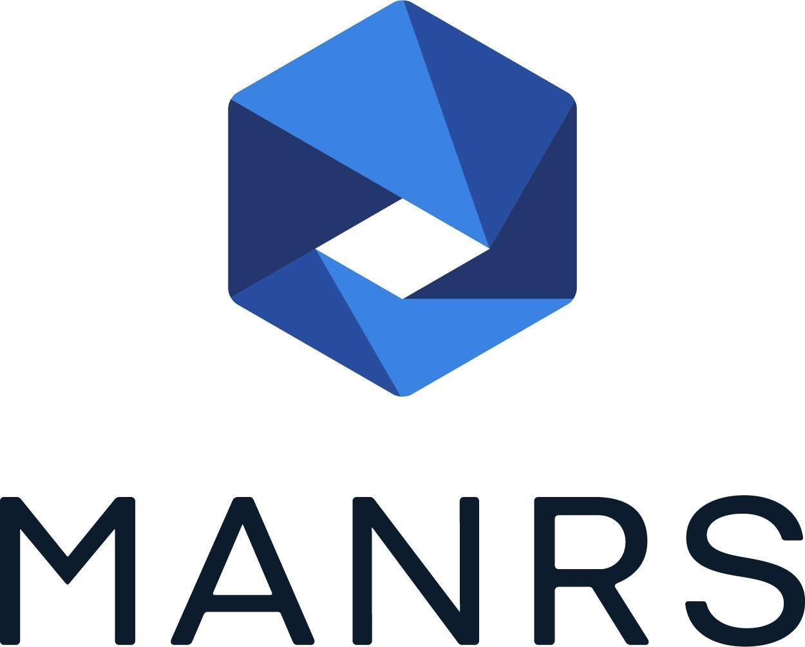
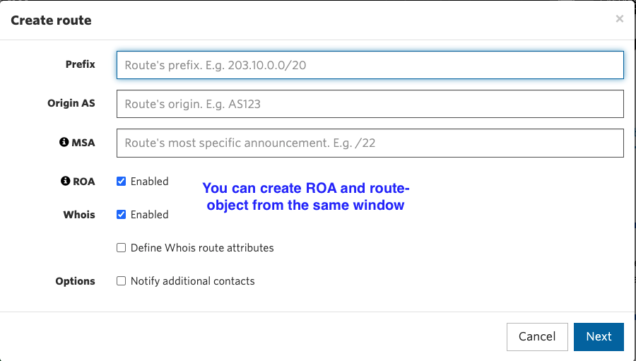
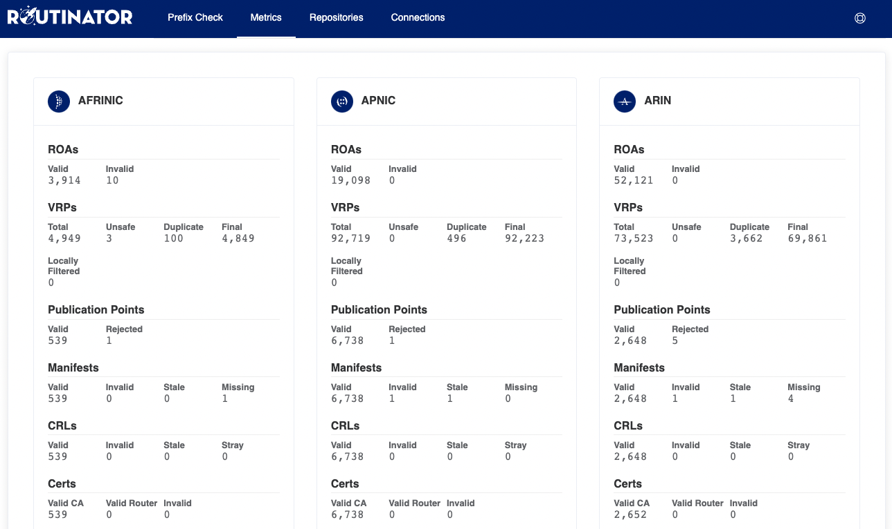

# Mutually Agreed Norms for Routing Security (MANRS) Implementation Guide



Version 1.1 , BCOP series Publication Date: 25 January 2017


# What is a BCOP?

A Best Current Operational Practices (BCOP) document describes best current operational practice on a particular topic, as agreed by subject matter experts and periodically reviewed by the Internet
community.

# Summary

The Mutually Agreed Norms for Routing Security (MANRS) BCOP provides guidance on how to deploy the measures required by MANRS and is targeted at stub networks and small providers. This document will also help in checking whether a network setup is conformant with MANRS.

# MANRS

Throughout the history of the Internet, collaboration amongst participants and shared responsibility for its smooth operation have been two of the pillars supporting the tremendous growth and success of the Internet, as well as its security and resilience. Technology solutions are an essential element here, but technology alone is not sufficient. To stimulate visible improvements in this area, a greater change toward a culture of collective responsibility is needed.
As such, we are calling upon network operators around the world to join the <u>Mutually Agreed Norms for Routing Security (MANRS) initiative by agreeing to its</u> Principles and implementing its Actions.

## The MANRS Principles

- We (the ISP/network operator) recognize the interdependent nature of the global routing system and our own role in contributing to a secure and resilient Internet.

- We will integrate best current practices related to routing security and resilience in our network management processes in line with the Actions.

- We are committed to preventing, detecting and mitigating routing incidents through collaboration and coordination with peers and other ISPs in line with the Actions.

- We encourage our customers and peers to adopt these Principles and Actions.

## The MANRS Actions

1. Filtering - Preventing propagation of incorrect routing information.
  - Network operator defines a clear routing policy and implements a system that ensures correctness of their own announcements and announcements from their customers to adjacent networks with prefix and AS-path granularity.
  - Network operator is able to communicate to their adjacent networks which announcements are correct.
  - Network operator applies due diligence when checking the correctness of their customer’s announcements, specifically that the customer legitimately holds the ASN and the address space it announces.

2.  Anti-Spoofing - Preventing traffic with spoofed source IP addresses.
  - Network operator implements a system that enables source address validation for at least single-homed stub customer networks, their own end-users and infrastructure. Network operator implements anti-spoofing filtering to prevent packets with an incorrect source IP address from entering and leaving the network.

3.  Coordination - Facilitating global operational communication and coordination between network operators.
  - Network operator maintains globally accessible up-to-date contact information.

4.  Global Validation - Facilitating validation of routing information on a global scale.
  - Network operator has publicly documented routing policy, ASNs and prefixes that are intended to be advertised to external parties.

## Becoming a MANRS Participant

Network operators who agree to the Principles and implement Actions 1, 3 and 4 as a minimum can become a MANRS Participant. This entitles you to use of the MANRS badge and being listed on the [MANRS website](https://manrs.org), and you can contribute to this document and others like it.

The proposed recommendations, referred to as Actions in the MANRS document and in this BCOP, address the most common cases and are designed to incur minimum cost and risk when implementing them. Any particular Action is not a comprehensive solution to the outlined problems.

# Implementation guidelines for the MANRS Actions

The selection of Actions was based on an assessment of the balance between small, incremental individual costs and the potential common benefit. They define a minimum security baseline. Any particular Action is not a comprehensive solution to the outlined problems.
For configuration examples a simple topology, presented in fig 1. is used.


Fig 1. Simple network topology

The goal is to ensure that network operators have accurate contact information so they can reach out to each other when necessary, that traffic leaving the network uses valid source addresses and that all routing information that is exchanged between autonomous systems is correct and can be verified.

# Coordination - Facilitating global operational communication and coordination between network operators

This is a **required** Action:

  - Network operator maintains globally accessible up-to-date contact information

Publicly accessible and up-to-date contact information is essential to promoting communication and collaboration between network operators. Network operators are advised to maintain their contact data in common places such as PeeringDB, on objects registered in RIR Whois databases such as RADB, AfriNIC, APNIC, ARIN, LACNIC and RIPE, and also on their public website.

At a minimum, a network operator should register and maintain 24/7 contact information in at least one of these databases. This contact information should include the operator’s current point of contact information for the NOC of their ASN, all netblocks, and domain names.
Additional information is also welcome and encouraged, such as documenting of route policy in an IRR and contact information on a public web page, providing a public looking glass URL in the appropriate field in their PeeringDB record, etc.

The following is a list of these common places along with recommendations on which information should be maintained and how it can be presented. At the minimum, a network operator should register and maintain 24/7 contact information in at least one of these resources.

## Maintaining Contact Information in Regional Internet Registries (RIRs): AFRINIC, APNIC, ARIN, LACNIC, RIPE 

While all of the RIRs require their registrants to keep their primary contact information up-to- date, the RIRs also offer the capability to add additional contacts and contact information to records in their databases. Operators are encouraged to add/maintain the NOC contact information where they have RIR objects. Operators are also encouraged to make use of the ‘remarks’ field (where applicable) to further aid users in making contact information or other useful information easy to obtain.

All RIRs maintain a whois system that combines Internet resource registration with their own Internet Route Registry. For objects in these databases, operators should create/maintain a NOC role object and include that object in the “tech-c” attribute of AUT-NUM, INETNUM, INET6NUM, AS-SET, and ROUTE-SET objects. The use of the ‘remarks’ attribute also allows for the documentation of contact information, and can be added to the above object types and also to ROUTE and ROUTE6 objects (discussed later).

### MNTNER objects

A maintainer (or MNTNER) object in an IRR database is used for managing authorization and authentication. Other objects refer to maintainers using, for example, one or more “mnt-by” attributes. Such an attribute protects those objects by only allowing changes when the updater can authenticate themselves as one of the maintainers.

Maintainers always have to refer to a contact who is responsible for that maintainer. Therefore to create new maintainers it is necessary to also create a contact person.

#### Creating a new maintainer in the AFRINIC IRR

To create a new maintainer in the AFRINIC IRR you first need an existing person or role object to use as the contact for the maintainer. The AFRINIC IRR allows you to create a person and/or role object that is not protected by a maintainer. While not protecting your data in the IRR is highly discouraged, it does provide you with a starting point. First create a PERSON object in the database by sending an email with content like the following to [auto-dbm@afrinic.net](mailto:auto-dbm@afrinic.net):

```
person: Some Random Person
address: Somewhere 7300 XX Apeldoorn The Netherlands
phone: +31-55-0000000
e-mail: <someone@example.com>
nic-hdl: AUTO-1
notify: <someone@example.com>
changed: <someone@example.com>
source: AFRINIC
```

The “nic-hdl” specifies the identifier that other objects can refer to. By specifying AUTO-1 during creation the system will automatically generate a unique identifier, which you will see in the confirmation email you receive from the database after the object has been created.
In this example we’ll assume the new identifier is “SRP9999-AFRINIC”.

Now that you have a contact person in the database you can create a maintainer by sending an email with content like the following to [auto-dbm@afrinic.net](mailto:auto-dbm@afrinic.net):

```
mntner: MAINT-AS64500
descr: Some Random Person’s maintainer
admin-c: SRP9999-AFRINIC
upd-to: <someone@example.com>
auth: BCRYPT-PW \#Filtered
mnt-by: MAINT-AS64500
changed: <someone@example.com>
source: AFRINIC
password: SomePassword
```

The “auth:” attribute contains a hashed password which you can create on [https://www.afrinic.net/whois/utilities#crypt](https://www.afrinic.net/whois/utilities#crypt)

The MD5-PW and CRYPT-PW methods which were previously in use are now deprecated.

This example uses a mnt-by attribute that references itself. This means that the data for this maintainer is protected by the maintainer itself. To prove that you are indeed authorized to create this maintainer you have to provide the password matching the auth attribute as an extra attribute when sending the update. This password attribute will not be stored in the IRR database.

Now that we have a MNTNER we need to protect our PERSON object with it. Otherwise anybody could submit changes to it. Updating an existing object is done by sending a modified version of the object to [auto-dbm@afrinic.net](mailto:auto-dbm@afrinic.net):

```
person: Some Random Person
address: Somewhere
7300 XX Apeldoorn The Netherlands
phone: +31-55-0000000
e-mail: <someone@example.com>
nic-hdl: SRP9999-AFRINIC
notify: <someone@example.com>
mnt-by: MAINT-AS64500
changed: <someone@example.com>
source: AFRINIC
password: SomePassword
```

In this example we added a mnt-by attribute to protect the person. Remember to use the real nic-hdl for the person when sending the update so that the IRR database knows to update the person object instead of creating a new one. To show that we are authorized to add this maintainer we also have to provide the maintainer’s password when sending the update. Again, this password attribute will not be stored in the IRR database.

Now we have a PERSON (nic-hdl: SRP9999-AFRINIC) and a maintainer (mntner: MAINT- AS64500) that we can use to publish further data in the IRR.

### Creating a new maintainer in the APNIC IRR

APNIC automatically creates a maintainer and role object for all new members. If members wish to create a new maintainer object, they can create it through the MyAPNIC portal at <u>https://myapnic.net</u>: MyAPNIC -> Resources -> Whois updates -> Add -> Mntner

### Creating a new maintainer in the RIPE IRR

The RIPE IRR does not permit objects to be unprotected. It is therefore not possible to create a PERSON object first and then create a MNTNER that references that person. It is also not possible to create a MNTNER first because it needs a reference to a PERSON.

To resolve this catch-22 situation, the RIPE NCC provides a web interface to create a person and maintainer together at <u>https://apps.db.ripe.net/db-web-ui/\#/webupdates/create/person/self</u>. To be able to access that page you need to have a RIPE NCC Access account, which can be created at <u>https://access.ripe.net/registration</u>.

Your maintainer is automatically linked to your access account so that you are automatically authenticated as that maintainer when editing IRR objects through the web interface. You can also edit the maintainer and add an “auth: MD5-PW” attribute. That allows you to submit updates through the e-mail interface at [auto-dbm@ripe.net](mailto:auto-dbm@ripe.net) in the same way as described above for the AFRINIC IRR.

## ROLE objects

PERSON objects are important points of contact, especially in very small organisations. They are too limited for a more complex organisational structure though. In many cases the proper point of contact is a department, a job function or a group of people. For that the IRR system supports ROLE objects.

A ROLE object can be referenced everywhere a PERSON object can. Both are identified by their nic-hdl attribute. The advantage of using a ROLE object is that while people can change jobs and move to a different organisation, a role does not change. A ROLE object can, in fact, optionally refer to other PERSON objects, adding information about contact persons for a specific group or department.

This is an example of a typical role object which utilizes the _remarks_ attribute to provide additional information. In this example, the network operator provides contact details for the ‘role’ object, but also provides summary information in the ‘remarks’ attribute not just for their NOC information, but also for their abuse and security contacts, and a URL to the operator’s PeeringDB info page.

```
role: AS64500 NOC
remarks: NOC: <noc@example.net>
remarks: Security issues: <security@example.net>
remarks: https://as64500.peeringdb.com/
e-mail: <noc@example.net>
abuse-mailbox: <abuse@example.net>
nic-hdl: AS64500NOC-RIPE
mnt-by: MAINT-AS64500
created: 2012-10-27T12:14:23Z
last-modified: 2016-02-27T12:33:15Z
source: RIPE
```

## INETNUM and INET6NUM objects**

IRRs are used to document information about resources such as IP address blocks and AS numbers. IPv4 ranges and IPv6 prefixes are documented using INETNUM and INET6NUM objects.

The ROLE object above is referenced in the ‘tech-c’ attribute of this INET\[6\]NUM object example. The ‘*remarks*’ attribute also provides additional information.

```
inet6num: 2001:db8::/32
netname: EXAMPLE-NET
descr: An example allocation
remarks: NOC: noc@example.net
remarks: Security issues: security@example.net
remarks: https://www.peeringdb.com/asn/64500
country: CH
status: ALLOCATED PA
org: ORG-AS64500-RIPE
admin-c: AS64500NOC-RIPE
tech-c: AS64500NOC-RIPE
mnt-by: RIPE-NCC-HM-MNT
mnt-lower: MAINT-AS64500
mnt-routes: MAINT-AS64500
created: 2012-10-27T12:14:23Z
last-modified: 2016-02-27T12:33:15Z
source: RIPE
```

IRRs that are linked to the RIR database don’t allow users to create their own top-level allocations. Those are automatically created by the RIR and can often only be edited through their web portal.

In the example given above you can see that the maintainer for the object is RIPE-NCC-HM-MNT, the maintainer of RIPE NCC itself. As a user you are only allowed to maintain (create) lower level objects, such as the assignments you make from this allocation and ROUTE/ROUTE6 objects to document routing the prefix.

## AUT-NUM objects

AS Numbers (ASNs) are documented using AUT-NUM objects. These objects contain information about the ASN and its peering policy. The level of detail that organisations publish in their AUT-NUM object varies. In this section we focus on the contact information. For information on publishing routing policies and using them for validation of routing information see sections 4.3 and 4.4.

An example of a minimal AUT-NUM object is:

```
aut-num: AS64500
descr: Provider 64500
mp-import: from AS64510 accept ANY except FLTR-BOGONS mp-export: to
AS64510 announce AS64500:AS-ALL
admin-c: AS64500NOC-RIPE
tech-c: AS64500NOC-RIPE
mnt-by: MAINT-AS64500
created: 2012-10-27T12:14:23Z
last-modified: 2016-02-27T12:33:15Z source: RIPE
```

## Maintaining Contact Information in Regional Internet Registries

(RIRs): **LACNIC** uses a different system where resource holders can update their contact information through the lacnic.net web interface. While the format of the information looks the same as for the IRRs, there are significant differences. For example there is no INET6NUM object type, both IPv4 and IPv6 address space uses INETNUMs. The possible attributes for the object types are different as well.

Contact information can be updated in LACNIC’s administrative system: [http://milacnic.lacnic.net](http://milacnic.lacnic.net)

Logging in with your userID you can access information about your personal user, organization information and resources information.

- In the tab “ID UPDATE\[userID\]” you can update info about you personal user.
- By clicking on any organization under the “Entities” section you will be able to change the POC’s of said entity (admin POC, billing POC and/or membership POC)
- Finally, still in the selected organization, you will be able to change the technical or abuse POC of a specific resource associated to such organization by clicking on the ASN or IP block desired.

New POC’s must be previously created at [http://www.lacnic.net/newid](http://www.lacnic.net/newid).

In order to change general information about the organization you must send an e-mail to <hostmaster@lacnic.net>

POC record example:

```
nic-hdl: SRA
person: Sergio Rojas Astigarraga
e-mail: <sergio@LACNIC.NET>
address: Rambla Rep. de México, 6125, address: 1400 - Montevideo -
country: UY
phone: +598 2 6042222 \[\]
created: 20090904
changed: 20161205
```

Org example:

```
owner: LACNIC DEBOGON TESTER
ownerid: UY-OPPL-LACNIC responsible: Sergio Rojas
address: Rambla Republica de México, 1234, address: 11400 - Montevideo - MV
country: UY
phone: +598 2 6041111 \[\]
owner-c: SRA
created: 20100222
changed: 20161205
nic-hdl: SRA
person: Sergio Rojas Astigarraga
e-mail: <sergio@LACNIC.NET>
address: Rambla Rep. de México, 6125, address: 1400 - Montevideo -
country: UY
phone: +598 2 6042222 \[\]
created: 20090904
changed: 20161205
aut-num: 64500
inetnum: 2001:db8:1000::/36
inetnum: 203.0.113.0/24
```

## Maintaining Contact Information in Regional Internet Registries (RIRs): ARIN

For ARIN, the process is slightly different for creating contacts from
the AFRINIC/APNIC/RIPE and LACNIC examples described above. For ARIN
records, an operator must first create a Point of Contact (POC) record
in the ARIN database. Once the POC record has been created, the
operator can associate the POC record to their network resources (ASN,
IP Addresses) as a NOC POC.

### Point of Contact (POC) Object Example

This is a typical example of what a POC record would look like for an ARIN POC record:

```
Name: Example ISP NOC
Handle: EXAMPLENOC-ARIN
Company: Example ISP
Address: 123 X Street
City: New York
StateProv: NY
PostalCode: 10011
Country: US
RegDate: 2015-01-01
Updated: 2015-01-01
Phone: +1-800-555-1212
Email: <noc@example.net>
```


### OrgNOCHandle in Network Object Example

The following would appear in whois query results for an operator’s ASN and Network resource(s) after the POC has been configured as a NOC contact:

```
OrgNOCHandle: EXAMPLENOC-ARIN
OrgNOCName: Example ISP NOC OrgNOCPhone: +1-800-555-1212
OrgNOCEmail: noc@example.net
OrgNOCRef: https://whois.arin.net/rest/poc/EXAMPLENOC-ARIN
```

## Maintaining Contact Information in Internet Routing Registries

Since Internet Routing Registries are used to validate routing information, keeping contact information for those objects up-to-date is important as well.

To create/maintain a NOC contact and add it as a ‘tech-c’ attribute in AUT-NUM, AS-SET, and ROUTE-SET objects in a route registry, please refer to the AFRINIC/APNIC/LACNIC/RIPE example under Regional Internet
Registries above.

The ROUTE/ROUTE6 objects do not allow for a ‘tech-c’ attribute. The recommended way to add/maintain contact information of a ROUTE object is to utilize the ‘remarks’ attribute to make the information easily
accessible.

For example:

```
route6: 2001:db8:1000::/36
descr: Provider 64500
origin: AS64500
remarks: Abuse/UCE: abuse@example.net
remarks: Network: noc@example.net
remarks: Security issues: security@example.net
remarks: https://as64500.peeringdb.com/
mnt-by: MAINT-AS64500
created: 2012-10-27T12:14:23Z
last-modified: 2016-02-27T12:33:15Z source: RIPE
```

For debugging purposes it is useful to document an IP address that is pingable from the outside and a contact for questions about that address:

```
route6: 2001:db8:1000::/36
descr: Provider 64500
origin: AS64500
pingable: 2001:db8:1000::1
ping-hdl: AS64500NOC-RIPE
mnt-by: MAINT-AS64500
created: 2012-10-27T12:14:23Z
last-modified: 2016-02-27T12:33:15Z
source: RIPE
```

## Maintaining Contact Information in PeeringDB

The PeeringDB ([https://www.peeringdb.com](https://www.peeringdb.com)) is an open resource for networks to share their peering information and other relevant information amongst each other. Networks are responsible for maintaining their records in the database.

Having a PeeringDB record allows you to consolidate your network information in a single location, and as an operator, allows you to research other networks and obtain additional information such as links to an operator’s looking glass, what facilities they peer in, contact information, etc.

There are three main steps for setting up a new PeeringDB record:

1.  Setting up a user account

    1.  Click “Register” from the header or visit [https://www.peeringdb.com/register](https://www.peeringdb.com/register) to begin the process.

2.  ASN Validation

    1.  Associate your user account with an organization

    2.  The association between user and organization will be validated
        by the PeeringDB team for new organizations.

    3.  The PeeringDB admin team will attempt to validate your request
        to create

    4.  A confirmation email will be sent when your organization has
        been approved.

3.  Setting up your initial PeeringDB record

    1.  Login with the user account created.

    2.  Click on the navigation icon
         )
        located in the upper right hand corner and select your
        organization.

    3.  Fill out and save your basic organization info.

    4.  Navigate to the bottom of the screen to the “Manage” section and
        select “Add Network”

    5.  Fill out the “Add Network” form and click “Submit Network”

    6.  The network will be reviewed by the PeeringDB staff before it
        will be publically available

4.  Adding details to the PeeringDB record

    1.  Login with the user account created.

    2.  Click on the navigation icon
        )
        located in the upper right hand corner and select your
        organization.

    3.  Navigate to the bottom of the screen to the “Networks” section
        and select your network

    4.  The standard PeeringDB view for a network will appear. Click the
        “Edit” button to update the data on the page.

    5.  From the “Edit” view, you can do the following:

        1.  Manage Contacts - Enter contact information for your
            important network contacts such as a NOC, Security Team, and
            Peering Policy contact

        2.  Add Secondary Information - Information such as Looking
            Glass URL, number of routes, etc.

        3.  Manage Private Peering Facilities - These are locations
            where an operator can peer with your network.

        4.  Manage Exchange Points - These are Internet Exchanges where
            your network participates.

### Company Website

Providing an additional source of contact and route policy information on a company website is beneficial for those operators who are not yet familiar with the PeeringDB or querying an RIR.

To help support open communication, below is a list of recommended items for network operators to consider publishing on their website:

Contact Info (RFC2142 mailboxes and phone numbers, if applicable)

- Network Operations
- Support
- Abuse
- Security
- Other relevant contacts

Routing Policy

- BGP Communities (Peer and Customer)
- BGP Filtering Policy (Inbound and Outbound)
- Route Dampening Policy
- MED (Multi-Exit Discriminator) Support Policy

# Global Validation - Facilitating validation of routing information on a global scale

This is a **required** Action, either using an IRR and/or implementing
RPKI:

-   *Network operator is able to communicate to their adjacent networks which announcements are correct;*
-   *Network operator has publicly documented routing policy, ASNs and prefixes that are intended to be advertised to external parties.*

Routing information should be made available on a global scale to facilitate validation, which includes routing policy, ASNs and prefixes that are intended to be advertised to third parties. Since the extent of the internet is global, information should be made public and published in a well known place using a common format."

MANRS participants should maintain updated public information in order to facilitate the validation of routing information. This includes the following data:

<table>
<tbody>
<tr class="odd">
<td><blockquote>
<p><strong>Object</strong></p>
</blockquote></td>
<td><blockquote>
<p><strong>Source</strong></p>
</blockquote></td>
<td><blockquote>
<p><strong>Description</strong></p>
</blockquote></td>
</tr>
<tr class="even">
<td><blockquote>
<p>aut-num</p>
</blockquote></td>
<td><blockquote>
<p>IRR</p>
</blockquote></td>
<td><blockquote>
<p>Policy documentation</p>
</blockquote></td>
</tr>
<tr class="odd">
<td><blockquote>
<p>route/route6</p>
</blockquote></td>
<td><blockquote>
<p>IRR</p>
</blockquote></td>
<td><blockquote>
<p>NLRI/origin</p>
</blockquote></td>
</tr>
<tr class="even">
<td><blockquote>
<p>as-set</p>
</blockquote></td>
<td><blockquote>
<p>IRR</p>
</blockquote></td>
<td><blockquote>
<p>Customer cone</p>
</blockquote></td>
</tr>
<tr class="odd">
<td><blockquote>
<p>ROA</p>
</blockquote></td>
<td><blockquote>
<p>RPKI</p>
</blockquote></td>
<td><blockquote>
<p>NLRI/origin</p>
</blockquote></td>
</tr>
</tbody>
</table>

### Valid Origin documentation

The goal of origin validation is to verify that the rightmost - also called the originator - ASN in an AS\_PATH is correct. This can be verified by correlating address space (or prefixes) and ASNs, and to facilitate this, all MANRS participants should make this information publicly available in databases such as the IRRs. They should also encourage (or possibly insist) that its IP transit customers do the same for their own address space.

The two most widely used methods for communicating origin authorisation are:

- route/route6 objects registered in one of the IRR databases; and
- ROAs published in the RPKI system

Since the resource holder does not know ahead of time which
information source may be used for validation by a 3rd party, resource
holders *should utilise both methods.*

#### Providing information through the IRR system**

The approach to this will differ depending on which RIR region your network mainly sits in, or is operated from. We recommend the use of the IRR provided by the RIR for your region.

Provider aggregatable (PA) and provider independent (PI) resources allocated to your organisation(s) should be registered in the RIR IRR. Associated route objects (with your organisation’s assigned ASN) should also be created.

An AS-SET object should also be created for your LIR or network using a meaningful name and placed in the same IRR. AS-SETs are meant to group ASNs in meaningful ways. For example create an AS-SET AS64500:AS-CUSTOMERS which contains all customers of AS64500 (AS64501 and AS64502) and create an AS-SET AS64500:AS-ALL which contains both the ASN itself and its customers. This makes it easier for yourself and others to specify routing policy.

The table below summarises the recommended route of registration:

<table>
<tbody>
<tr class="odd">
<td><blockquote>
<p><strong>Region</strong></p>
</blockquote></td>
<td><blockquote>
<p><strong>Preferred IRR</strong></p>
</blockquote></td>
<td><blockquote>
<p><strong>Alternative IRR</strong></p>
</blockquote></td>
</tr>
<tr class="even">
<td><blockquote>
<p>ARIN</p>
</blockquote></td>
<td><blockquote>
<p>ARIN</p>
</blockquote></td>
<td><blockquote>
<p>RADB / NTTCOM</p>
</blockquote></td>
</tr>
<tr class="odd">
<td><blockquote>
<p>AFRINIC</p>
</blockquote></td>
<td><blockquote>
<p>AFRINIC</p>
</blockquote></td>
<td><blockquote>
<p>RADB / NTTCOM</p>
</blockquote></td>
</tr>
<tr class="even">
<td><blockquote>
<p>APNIC</p>
</blockquote></td>
<td><blockquote>
<p>APNIC</p>
</blockquote></td>
<td><blockquote>
<p>RADB / NTTCOM</p>
</blockquote></td>
</tr>
<tr class="odd">
<td><blockquote>
<p>RIPE</p>
</blockquote></td>
<td><blockquote>
<p>RIPE NCC</p>
</blockquote></td>
<td><blockquote>
<p>RADB / NTTCOM</p>
</blockquote></td>
</tr>
<tr class="even">
<td><blockquote>
<p>LACNIC</p>
</blockquote></td>
<td><blockquote>
<p>LACNIC</p>
</blockquote></td>
<td><blockquote>
<p>RADB / NTTCOM</p>
</blockquote></td>
</tr>
</tbody>
</table>

We also recommend complementary registration in NIRs where national data quality is an issue - these are APJII (Indonesia), CNNIC (China), IRINN (India), JPNIC (Japan), KRNIC (South Korea), TWNIC (Taiwan), VNNIC (Vietnam), NIC.br (Brazil) and NIC Mexico (Mexico).

#### Registering expected announcements in the IRR

For documenting which ASN is allowed to announce which address prefix, ROUTE/ROUTE6 objects are used. Their purpose is to link an AUT-NUM to an INETNUM/INET6NUM.

The following example documents that AS64500 is allowed to announce
prefix 2001:db8:1000::/36:

```
route6: 2001:db8:1000::/36
descr: Provider 64500
origin: AS64500
mnt-by: MAINT-AS64500
created: 2012-10-27T12:14:23Z
last-modified: 2016-02-27T12:33:15Z
source: RIPE
```

You should create ROUTE/ROUTE6 objects for each exact prefix and ASN you want to see in the routing table.

#### Providing information through the RPKI system

The RPKI repository can store information about prefixes originated by your network in the form of Route Origin Authorization (ROA) objects. Note, that these do not include your customer announcements, but only prefixes that belong to your ASN. Only the origin ASN is verified, not the full path.

#### RIR Hosted Resource Certification service

All Regional Internet Registries offer a so-called hosted Resource Certification service where keys are kept and managed by the RIR and all operations are performed on the RIR’s servers.

The procedure of signing up and using the ROA management portal are different for each RIR. The pointers below will provide necessary information:

- AfriNIC: [https://www.afrinic.net/en/initiatives/resource-certification](http://www.afrinic.net/en/initiatives/resource-certification)

- ARIN: [https://www.arin.net/resources/rpki/index.html\#howtoparticipate](http://www.arin.net/resources/rpki/index.html#howtoparticipate)

- APNIC: [https://www.apnic.net/manage-ip/apnic-services/resource-certification](http://www.apnic.net/manage-ip/apnic-services/resource-certification)

- LACNIC: [http://www.lacnic.net/en/web/lacnic/certificacion-de-recursos-rpki](http://www.lacnic.net/en/web/lacnic/certificacion-de-recursos-rpki)

- RIPE: [https://www.ripe.net/manage-ips-and-asns/resource-management/certification/using-the-rpki-system](http://www.ripe.net/manage-ips-and-asns/resource-management/certification/using-the-rpki-system)

Each RIR is different, but common requirements for obtaining a certificate include:

- valid membership with the RIR;
- access to the resource management portal;
- agreement with the Terms and conditions of the service.


#### RIR Delegated Resource Certification service

Currently ARIN, APNIC, LACNIC and RIPE offer RPKI in "delegated" mode.  With delegated RPKI, you can run your own RPKI Certification Authority, manage your ROAs and publish them in your own repository. It also allows you to further delegate Certification Authorities.

#### RIR portal

An RIR portal offers an interface for performing various operations with ROAs: creation and publication, modification, deletion. Some portals provide tools to generate ROAs from the observed

BGP announcements, compare created ROAs with existing BGP announcements and determine the impact that publication of ROAs will have on the existing BGP announcements.

This is the RIPE NCC RPKI ROA Dashboard as an example:


When creating a ROA, pay special attention to the "maximum length" field. If set to the length of the prefix, such a ROA may invalidate announcements of more specific prefixes unless other ROAs are also created for them. An issuer of a ROA SHOULD advertise all prefixes covered by the ROA, all the way down to the maximum length. If it does not, then an adversary can advertise the most specific with the authorized ASN prepended. Then the adversary will draw the traffic, intercept it (sending to the legitimate destination afterwards) or, more commonly, simply blackholing it causing a DoS attack.

It is recommended to:

-   avoid creating ROAs for subnets of an aggregate unless they are actually routed; and
-   minimise ROAs where possible and only for prefixes actually announced.

The image below shows how to add ROAs using AFRINIC’s portal:


The images below show how to add ROAs using APNIC’s portal:



### Using the RPKI and require the customers to register ROA

The basic idea for automating validation of customer announcements with RPKI is the same as for the IRR. However using RPKI in such cases requires that the customer fully manages their address space in whatever system is supported by the RIR they received their address blocks from. For smaller customers, or customers that received their address space as an assignment from their provider, the provider may decide to do RPKI management on their behalf.

### ROAs with Origin AS = 0

AS number 0 is indicated in the IANA registries as reserved (see this [link](https://www.iana.org/assignments/as-numbers/as-numbers.xhtml)). [RFC 6491](https://tools.ietf.org/html/rfc6491) - Resource Public Key Infrastructure (RPKI) Objects issued by IANA, specifies that the value of AS = 0 in an ROA is used to identify prefixes that should not be announced to the Internet and therefore are not usable for packet routing. This allows whoever has a certain IP prefix to indicate that the prefix and possibly all of the IP subnets, may not be used for IP packet routing. Any prefixes with Origin AS = 0 should be dropped, if they appear on the Internet with another Origin AS their state will be invalid (achieving the scope).

The use of AS = 0 has been specified in [RFC7607](https://tools.ietf.org/html/rfc7607) - Codification of AS 0 Processing, August 2015.

#### Ensure that the RPKI certificate(s) and ROAs are kept up to date

Establish a process that ensures that every time you originate a new prefix from your network, a corresponding ROA is created or modified to reflect this change. This should become a normal process integrated in the procedures of your NOC.

### Additional reading**

Informational:

- Resource Public Key Infrastructure [https://en.wikipedia.org/wiki/Resource_Public_Key_Infrastructure](https://en.wikipedia.org/wiki/Resource_Public_Key_Infrastructure)

- NRO Information on RPKI [https://www.nro.net/wp-content/uploads/RPKI.pdf](http://www.nro.net/wp-content/uploads/RPKI.pdf)

- NRO video on Resource Certification [https://youtu.be/rH3CPosGNjY](https://youtu.be/rH3CPosGNjY)

- The use of MaxLength in RPKI [https://datatracker.ietf.org/doc/draft-ietf-sidrops-rpkimaxlen/](https://datatracker.ietf.org/doc/draft-ietf-sidrops-rpkimaxlen/)

## Routing policy documentation

While ROUTE/ROUTE6 objects are most commonly used to collect the information required to build filters for origin validation, a starting point for many existing toolkits is the routing policy for an ASN expressed in the aut-num object.

Such routing policy may be made available by describing it using the Routing Policy Specification Language (RPSL - RFCs 4012, 2622 and others), in the “mp-import” and “mp- export” attributes of an aut-num object registered in an IRR database.

The choice of how best to represent policy in RPSL will vary between ASNs, and there often exists more than one way to describe a given policy. However, most policy statements include the use of as-set objects to group customer ASNs together.

### Basic policy documentation**

The following example illustrates the policy of AS64500 from figure 1.

```
aut-num: AS64500
descr: Provider 64500
remarks: ++ Customers ++
mp-import: from AS64501 accept AS64501\[AR2\] mp-export: to AS64501
announce ANY
mp-import: from AS64502 accept AS64502 mp-export: to AS64502 announce
ANY remarks: ++ Peers ++
mp-import: from AS64511 accept AS64511:AS-ALL mp-export: to AS64511
announce S64500:AS-ALL remarks: ++ Transit ++
mp-import: from AS64510 accept ANY except FLTR-BOGONS mp-export: to
AS64510 announce AS64500:AS-ALL
mnt-by: MAINT-AS64500
created: 2012-10-27T12:14:23Z
last-modified: 2016-02-27T12:33:15Z
source: RIPE
```

A common approach, usually applied to peers and less often to transit providers, is using aut-num, as-set and other object sets derived from AS policy documentation and then expanding them into route objects, explicit filter expressions, etc. to build the required filters.

A third party, AS64511 for instance, could take the AS64500 aut-num object, collect the customer cone (AS64500:AS-CUSTOMERS), collect related route/route6 objects (sometimes expanding other included sets and explicit filters) and obtain a list of prefixes that represent legitimate announcements from AS64500 to its peers.

It is not always clear from the policy in an aut-num object which as-set object should be used to build the above filters. It is therefore recommended that MANRS participants additionally insert the name of this as-set in the “IRR Record” field of their peeringDB record.

### Advanced policy documentation

Although RPSL is a rich language, and can be used to express complex policy constructs, doing so in a usable (human-readable or machine-parsable) fashion can be challenging. Some examples of what is possible:

```
mp-import: afi ipv4.unicast from AS64510 192.0.2.1 at 192.0.2.2 action pref = 10; med = 0; community.append(64500:10); aspath.prepend(AS64500, AS64500) accept ANY except FLTR-BOGONS
mp-export: protocol BGP4 into OSPF
to AS64500 announce ANY
default: to AS64510 192.0.2.100 at 192.0.2.101
```

Whether you keep it simple or whether you document every last detail of your configuration depends mostly on your organisation’s policies. MANRS participants with unusual or complicated policies may also choose to describe these separately in a human-readable document, and make that available to other operators by providing links to the document’s location in the “remarks” attribute of their aut-num object and/or in the “Notes” field of their peeringDB record.

### Summary

RPSL can also be used to document every single router, interface, peering session, filter and route-map. In practice there are very few organisations that publish such extensive data though. The reasons for that are the maintenance effort involved but also for example confidentiality of the details of peering agreements and reluctance of management to allow publicly documenting business practices. As a minimum it is recommended to document at least every peering between ASNs with a reasonable definition of what routes are exchanged.

### Additional reading

- Using RPSL in Practice [https://tools.ietf.org/html/rfc2650](https://tools.ietf.org/html/rfc2650)
- Routing Policy Specification Language [https://tools.ietf.org/html/rfc2622](https://tools.ietf.org/html/rfc2622)
- Routing Policy Specification Language next generation [https://tools.ietf.org/html/rfc4012](https://tools.ietf.org/html/rfc4012)
- Routing Policy System Security [https://tools.ietf.org/html/rfc2725](https://tools.ietf.org/html/rfc2725)

# Anti-Spoofing - Preventing traffic with spoofed source IP addresses

This is a **recommended** Action:

- *Network operator implements a system that enables source address validation for at least single-homed stub customer networks, their own end-users and infrastructure. Network operator implements anti-spoofing filtering to prevent packets with incorrect source IP address from entering and leaving the network.*

IP source address spoofing is the practice of originating IP datagrams with source addresses other than those assigned to the host of origin. In simple terms, the host pretends to be another host which can be exploited in various ways, most notably to execute Denial of Service (DoS) reflection-amplification attacks that cause a reflector host to send traffic to the spoofed address.

There are many recommendations to prevent IP spoofing by ingress filtering, e.g. checking source addresses of IP datagrams close to the network edge.

***Most equipment vendors support ingress filtering in some form. Since 2005, deployment of anti-spoofing techniques has not been a limitation of the equipment performance. It has been a limitation of desire and willingness to deploy and maintain the anti-spoofing configuration.***

Ironically, significant DoS amplification attacks can be expensive for Service Providers. The costs hurt the brand, damage customer operations, and have collateral operational/cost impact on other customers. These DoS amplification attacks are preventable. They would be impossible without spoofing.

This demonstrates that ingress filtering is definitely not sufficiently deployed. Unfortunately, there are no benefits to a Service provider (SP) that deploys ingress filtering. There is also a widely held belief that ingress filtering only helps when it is universally deployed.

Common approaches to this problem have involved software features such as SAV (Source- Address Validation) on cable-modem networks or strict uRPF (unicast Reverse-Path Forwarding) validation on router networks. These methods can ease the overhead of administration in cases where routing and topology is relatively dynamic. Another approach could be to use inbound prefix filter information to create a packet-filter, which would only allow packets with source IP addresses for which the network could legitimately advertise reachability.

For most smaller and simpler network architectures the easiest way to prevent spoofing is by using Unicast RPF (uRPF) in Strict Mode. For filtering source addresses used by devices on a layer-2 domain the Source Address Validation Improvements (SAVI) can be used. On equipment where automatic filtering features are not available you can use Access Control Lists (ACLs) to manually implement equivalent filtering. All of these technologies are explained below.

### Guiding Principles for Anti-Spoofing Architectures

To be as effective as possible anti-spoofing techniques should be applied as close to the source as possible. In enterprise networks, the source addresses used by every device are often controlled and enforced so that security audits can pinpoint exactly which device sent which packet.

For a successful implementation of MANRS, such fine granularity at the device level is not necessary as MANRS focuses on routing security and anti-spoofing on a network level. Therefore common anti-spoofing architectures focus on making sure that customers don’t send packets with the wrong source addresses.

Enforcing the use of valid source addresses on a customer level has the benefit that customers can’t spoof each other’s addresses, which prevents them from causing problems for each other that are hard to debug.

If for some reason it is not possible to enforce source address usage per customer, then an alternative is to enforce it at aggregation points so that customers are at least limited in which addresses they can spoof. At a minimum there should be anti-spoofing at the ISP level so that customers can’t spoof addresses of other organisations and cause trouble on an Internet-wide scale.

### Unicast RPF

BCP38 uRPF Strict Mode with RFC1998++ style of multihoming (a BCP for multihoming) is an approach that works in symmetrical (single homed) and asymmetrical (multihomed BGP) configurations, and was first operationally deployed in 2002. Yes, there are many who think that "uRPF doesn't work because of routing asymmetry", but this is not true. Documentation from 2001, the ISP Essentials whitepaper (Google for version 2.9) and the ISP Essentials book<sup>1</sup> along with deployments in several major SPs have demonstrated that uRPF strict mode is a viable technique.

<sup>1</sup> ISBN 1587050412

There are four algorithms for uRPF - Strict Mode (check source IP and adjacency), Loose Mode (check only source IP), Feasible Path (check source IP with the FIB's alternatives), and VRF Mode (permit/deny check on source in a separate table from the FIB). Each of these uRPF options are designed for specific “anti-spoofing” functions in different parts of the network.

- **uRPF Strict Mode** - BCP38 on the customer-SP edge. Each incoming packet is tested against the FIB and if the incoming interface is not the best reverse path, the packet is dropped.
- **uRPF Loose Mode** - sRTBH anywhere in the network - but only check if the route is in the FIB. If not in the FIB, then drop. If it is in the FIB, then pass. Good for sRTBH and mitigating some spoofed traffic on the peering edge.
- **uRPF Feasible Path** - sRTBH anywhere in the network and BCP38 for multihomed customers and asymmetrical routes. In the feasible mode the FIB maintains alternate routes to a given IP address. If the incoming interface matches with any of the routes associated with the IP address, then the packet is forwarded. Otherwise the packet is dropped.
- **uRPF VRF Mode** - BGP based Peering Policy Enforcement or more granular sRTBH (NOTE VRF Mode might be used as BCP38, but is has not been operationally proven)

uRPF can be useful in many places in the network. It is most often used on the edges of the networks where customers, servers and/or clients are connected because Strict Mode works well there. Network operators are hesitant to use uRPF in the core of their networks because of the fear of accidentally dropping valid traffic that has taken an unexpected path through their network. uRPF Feasible Path mode should solve such problems.

Arista, Cisco and Juniper Networks implement both strict mode and loose mode. We show how to use strict mode. Configure uRPF Strict Mode on interfaces towards customers with:

Arista:

Cisco:

```
ip verify unicast source reachable-via rx

ipv6 verify unicast source reachable-via rx

ip verify unicast reachable-via rx ipv6 verify unicast reachable-via rx
```

Juniper:

```
family inet {
  rpf-check;
}

family inet6 {
 rpf-check;

}
```

That will make sure that the customer can only use IP addresses that you route to them. In situations where you are the customer of another ISP where you have a default route pointing to that ISP you should use:

Arista

```
ip verify unicast source reachable-via rx allow-default

ipv6 verify unicast source reachable-via rx allow-default
```

Cisco:

```
ip verify unicast reachable-via rx allow-default

ipv6 verify unicast source reachable-via rx allow-default
```

Juniper Networks:

Juniper routers automatically adapt their uRPF filtering based on where any default routes are pointing towards. Just use the same commands as above.

The allow-default option is necessary because by default the source addresses will be matched only against specific routes, ignoring the default route. While matching against the default route seems to be the same as allowing anything, it isn’t. It makes sure that your upstream doesn’t send you traffic for which you have other more-specific routes pointing in a different direction, such as your own networks and your customers’ networks. This will protect you against spoofed traffic from others.

### Dynamic Access List (Radius & Diameter)

The standard way to set access lists for Radius-authenticated users is through Radius attribute 11 (Filter-Id<sup>2</sup>). With this attribute you can tell the router to apply a pre-existing access list to the user’s connection. This does require an out-of-band method to provision all routers with the correct access lists though.

Some vendors have extra Radius options that can be used to dynamically provision the access list itself through Radius. Cisco for example provides extra functionality through cisco-avpair attributes:

```
cisco-avpair = "ip:inacl\#5=permit ip 192.0.2.0 0.0.0.255 any"
cisco-avpair = "ip:inacl\#99=deny ip any any"
```

This would only allow packets from the customer that have a source address in the 192.0.2.0/24 range.

### SAVI

SAVI is the name of the IETF working group that works on Source Address Validation Improvements. For the validation of a customer’s source address, the SAVI for DHCP solution in RFC 7513 is commonly used. This version of SAVI keeps track of all the IP addresses that have been assigned to each device by snooping on the DHCPv4 and DHCPv6 message exchanges on the network switch that the customer is connected to. If a customer uses an unauthorised source address the switch will drop the packet.

Vendors often use their own terminology to describe SAVI features. On Cisco devices these features are referred to as DHCP Snooping, Source Guard and Prefix Guard.

<sup>2</sup>
[https://tools.ietf.org/html/rfc2865\#section-5.11](https://tools.ietf.org/html/rfc2865#section-5.11)

### IP Verify Source

Ethernet networks are broadcast domains, and by default there is no validation of who is allowed to send packets with which addresses. To configure Cisco switches to verify the source addresses used by the connected devices the “ip verify source” setting can be used.

There are three variants of this feature:

-   ip verify source
-   ip verify source port-security
-   ip verify source tracking port-security

The first variant verifies the source IP address, the second variant also verifies the source MAC address and the third variant tracks the bindings between IP address and MAC address. To prevent customers from using another customer’s MAC address the last variant is recommended.

All of these base their decision on snooped DHCP data.

Before being able to verify source addresses the switch must be configured to snoop DHCP traffic to collect data to base its decisions on with ip dhcp snooping. To keep track of which ethernet port connects to each DHCP client use DHCP option 82 with ip dhcp snooping information option. This is necessary because with verify port-security the switch will not learn MAC addresses until the DHCP server has assigned an IP address to the connected device. Option 82 is therefore necessary to remind the switch where the client was connected.

There are several steps necessary to enable secure tracking of devices and verify their source addresses. The first step is to enable “*ip device tracking*” globally on the switch. This makes sure that the switch can track which IP address belongs to which MAC address. Then on each interface, define the number of devices that are allowed to connect with ip device tracking maximum *num* where *num* can be a number from 1 to 10. Now enable switchport port-security on each interface to ensure that only allowed MAC addresses are used. And finally enable the verification feature that links all these together with ip verify source tracking port-security.

Now the switch has all the information it needs to snoop DHCP traffic, link the IP addresses to MAC addresses and verify that all packets sent through the switch conform to the collected state which is based on responses from the DHCP server. Packets that do not conform to what the DHCP server has assigned will be dropped.

### Cable Source-Verify

Cable modem networks are in many ways similar to ethernet networks.
Unless configured otherwise, users can spoof source addresses or steal the addresses of other users on the cable network. The Cisco cable source-verify feature allows the CMTS operator to limit which source addresses a user is allowed to use.

There are two variants of this feature:

-   cable source-verify
-   cable source-verify dhcp

Both variants affect which addresses from the cable network’s subnet are allowed to be used. The first variant only prevents users from stealing each other’s addresses and is therefore not sufficient for MANRS. We will look at the second variant.

Configuring cable source-verify dhcp tells the CMTS that all source addresses must be verified against DHCP leases that the CMTS has seen.
If a packet is sent with a different source the CMTS will drop it. This will prevent users from using addresses not assigned to them via DHCP.

Problems can occur when the CMTS is reloaded. In such a case the CMTS won’t know all the DHCP leases from its users and might drop legitimate traffic. To solve this the CMTS can be configured to use the DHCP LeaseQuery protocol. This allows the CMTS to ask the DHCP server about leases for traffic it is seeing. Once the DHCP server confirms that there is a legitimate lease for that address the CMTS will add it to its cache and allow the traffic through.

To configure the CMTS to not trust ARP on the cable network configure it with no cable arp. This will make sure that only information learned from DHCP and LeaseQuery is trusted when verifying source addresses.
The cable source-verify feature only protects the subnet of the cable network itself. To prevent users from spoofing other addresses, and to allow traffic from customers that have a routed subnet which they are allowed to use, also configure *ip verify unicast source reachable-via rx* to enable uRPF Strict Mode on the cable network. That will check all source addresses that are not directly on the cable network and allow validating against for example static routes for routed subnets towards customers.

### Access Control List (ACLs)

ACLs are commonly deployed on the Provider Edge (PE) - Customer Edge (CE) boundary, but are also very useful in other places like towards the provider’s own server, client and infrastructure networks to prevent devices there from misbehaving. Optimized ACL strategy would be to place an *explicit permit filter* on the customer interface.  Explicit permit filters permit specific address ranges and then deny all else. For example, if an Operator’s customer is allocated 192.0.2.0/24, the BCP 38 ACL would permit all source addresses from 192.0.2.0/24 and then deny all packets whose source address is not 192.0.2.0/24.


Fig 2. Ingress filtering on a PE router

BCP 38 Filter = Allow only packets with source IP addresses from the customer's networks (2001:db8:1001::/48, 2001:db8:2002::/48, 192.0.2.0/24, 198.51.100.0/24)

On the downstream interfaces of the ISP, there should be filters that verify the source addresses used by its customers. If uRPF cannot be used then manual ACLs are necessary. Let’s take the first customer from the example diagram above:

Arista:

```
ip access-list customer1-in-ipv4
  10 permit ip 192.0.2.0/24 any
  65000 deny ip any any
!
ipv6 access-list customer1-in-ipv6
  10 permit ipv6 2001:db8:1001::/48 any
  65000 deny ipv6 any any
!

interface EthernetX
  ip access-group customer1-in-ipv4 in
  ipv6 access-group customer1-in-ipv6 in
```

Cisco:

```
ip access-list extended customer1-in-ipv4 permit ip 192.0.2.0 0.0.0.255 any
!

ipv6 access-list customer1-in-ipv6 permit ipv6 2001:db8:1001::/48 any
!

interface x
  ip access-group customer1-in-ipv4 in ipv6 traffic-filter
  customer1-in-ipv6 in
```

Juniper Networks:

```
firewall {
  family inet {
    filter customer1-in-ipv4 { term allowed-sources {
      from {
        source-address { 192.0.2.0/24;}
      }
      then accept;
    }
  }
}
family inet6 {
  filter customer1-in-ipv6 {
    term allowed-sources {
      from {
        source-address { 2001:db8:1001::/48;}
      }
      then accept;
    }
  }
}

interfaces x { 
  unit 0 {
    family inet {
      filter {
        input customer1-in-ipv4;
      }
    }
    family inet6 {
      filter {
         input customer1-in-ipv6;
      }
    }
  }
}
```

Mikrotik

To facilitate building of the ACLs, CAIDA provides a link that can be used to generate a proposed ACL based on BGP table analysis: [https://spoofer.caida.org/prefixes.php?asn=3333](https://spoofer.caida.org/prefixes.php?asn=3333)

### Aggregation Points

When ACLs at the PE-CE boundary are not possible, for example because multiple customers are connected to a single layer-2 network and the layer-2 devices do not have the features to filter on layer-3 information, then filtering at an aggregation point is the second-best solution.


Fig 3. Ingress filtering on the aggregation router


BCP 38 Filter = Allow only packets with source IP addresses from the customer's networks, aggregated (2001:db8:1000::/44, 2001:db8:2000::/44, 192.0.2.0/23, 198.51.100.0/23)

In this example it is (for some unspecified reason) not possible to filter on the /24 for each customer. In that case filtering on 96.0.18.0/23 and 96.0.20.0/23 at an aggregation point close to the customer connections would at least limit the spoofing possibilities for that group of customers to a small range of addresses.

Configuration is done in the same way as shown in the previous section, except now it is done on a different router in a more central location in the network.

###  Is NAT an Anti-Spoofing Tool?

By default many NAT implementations do not filter the source address of the clients. Take for example a simple NAT configuration on a Cisco router like:

```
ip nat inside source list INSIDE pool OUTSIDE overload
```

This NAT rule will translate packets with a source address in access list INSIDE and change the source address to an address in the pool OUTSIDE. However, packets that have a spoofed source address that is not included in the INSIDE access list will be forwarded without any translation, resulting in spoofed packets on the Internet. When a spoofed packet does match the access list it will be translated using the specified pool, so the outside world does not see a spoofed source address, but it will be impossible for the NAT operator to trace the spoofed packets back to their originator.

This shows that NAT is not an anti-spoofing tool. Even when using NAT the source addresses used by customers must be checked as close to the customer as possible, just like in the cases without NAT shown earlier in this chapter. Only then can spoofed and/or untraceable packets be prevented to reach the Internet.

### Testing your anti-spoofing controls


CAIDA have developed a tool called Spoofer (<https://spoofer.caida.org>) that can check whether traffic with spoofed source IP addresses is blocked by the network. The tool measures different types of spoofed addresses, including private and neighboring addresses.

### 10. Additional reading

- CAIDA Spoofer  
    [https://www.caida.org/projects/spoofer/](https://www.caida.org/projects/spoofer/)

- RIPE Anti-Spoofing Task Force HOW-TO [https://www.ripe.net/publications/docs/ripe-431](https://www.ripe.net/publications/docs/ripe-431)

- Source Address Validation Improvements (SAVI) Solution for DHCP [https://tools.ietf.org/html/rfc7513](https://tools.ietf.org/html/rfc7513)

- Setting Access Lists with Radius [http://blog.ipspace.net/2010/09/setting-access-lists-with-radius.html](http://blog.ipspace.net/2010/09/setting-access-lists-with-radius.html)

- Cisco: IPv6 First-Hop Security Configuration Guide [http://www.cisco.com/c/en/us/td/docs/ios-xml/ios/ipv6_fhsec/configuration/15-sy/ip6f-15-sy-book.html](http://www.cisco.com/c/en/us/td/docs/ios-xml/ios/ipv6_fhsec/configuration/15-sy/ip6f-15-sy-book.html)

- Cisco: Configuring DHCP Snooping, IP Source Guard, and IPSG for Static Hosts [http://www.cisco.com/c/en/us/td/docs/switches/lan/catalyst4500/12-2/1502SG/configuration/guide/config/dhcp.html](http://www.cisco.com/c/en/us/td/docs/switches/lan/catalyst4500/12-2/1502SG/configuration/guide/config/dhcp.html)

- Cisco: Configuring DHCP Features and IP Source Guard [http://www.cisco.com/c/en/us/td/docs/switches/lan/catalyst2960/software/release/12-2_53_se/configuration/guide/2960scg/swdhcp82.html](http://www.cisco.com/c/en/us/td/docs/switches/lan/catalyst2960/software/release/12-2_53_se/configuration/guide/2960scg/swdhcp82.html)

- Cisco: Cable Source-Verify and IP Address Security [http://www.cisco.com/c/en/us/support/docs/broadband-cable/cable-security/20691-source-verify.html](http://www.cisco.com/c/en/us/support/docs/broadband-cable/cable-security/20691-source-verify.html)

## Filtering - Preventing propagation of incorrect routing information

This is a **required** Action:

- *Network operator defines a clear routing policy and implements a system that ensures correctness of their own announcements and announcements from their customers to adjacent networks with prefix and AS-path granularity.*

- *Network operator applies due diligence when checking the correctness of its customer’s announcements, specifically that the customer legitimately holds the ASN and the address space it announces.*

Most important is to secure the inbound routing advertisements, particularly from customer networks, through the use of explicit prefix-level filters or equivalent mechanisms.

Secondarily, AS-path filters might be used to require that the customer network be explicit about which Autonomous Systems (ASes) are downstream of that customer. Alternately, AS-path filters that block announcements by customers of ASes with which the provider has a settlement-free relationship can prevent some types of routing “leaks”.

Keep in mind that a common error is a typo in the announced IP addresses, which causes the wrong addresses to be announced from an allowed ASN. Filtering customer BGP announcements by AS-path filters alone is therefore insufficient to prevent catastrophic routing problems at a systemic level.

Similarly, filtering outbound announcements towards non-customer peers alone is insufficient where the operator provides services to multi-homed customers. Consider for example the scenario where a customer advertises a set of longer prefixes to only one of several transit providers: those longer prefixes will be learnt by that customer’s other providers via settlement- free peering or from their own transits, but since the prefix belongs to a valid customer, the prefixes will not be filtered outbound towards non-customers if those filters are based only on prefix matching. The operator in question will therefore advertise transit reachability to those more specific prefixes even though their customer never announced those directly to them.

Operators should only announce transit for the prefixes that their customer announced directly to them, not prefixes learned through other paths.

Before building filters it is important to apply due diligence and check whether the information provided by the customer about their identity and resources is correct. Filters can check whether AS64501 is allowed to announce 192.0.2.0/24, but only verification of identity can determine whether your customer is really the holder of AS64501.

There are several ways to build these filters:

1. Use Internet Routing Registries (IRRs) and require the customers to register route objects

2. Use Resource Public Key Infrastructure (RPKI) and require the customers to create Route Origin Authorizations (ROAs)

3. Use an internal database with the information provided as part of the provisioning process This document will only focus on the first two cases, since case 3 is proprietary.

In general, an observed prefix in the routing system may be partially validated as originating in the correct origin ASN (i.e. against only the rightmost ASN in the AS\_PATH attribute), or fully validated
against the entire ordered set of ASNs in the AS\_PATH. These are referred to respectively as origin validation and path validation. While origin and path validation are related concepts, and may be performed through the use of an overlapping set of tools, they differ significantly with respect to the authoritative source of validation information as described below, and thus in the information that needs to be maintained by a MANRS participant.

### Using an IRR and require the customers to register route objects

Internet Routing Registries are central places where routing information is published. They document which ASNs are allowed to announce which IP addresses and what the policies are for exchanging routes between ASNs. This information can be used in router configurations to validate the received routes.

Note that not all IRRs are authenticated against authoritative sources. The AFRINIC, APNIC and RIPE NCC IRRs only allow users to enter resource records that match the resources they have allocated. Other IRRs may have less strict authentication mechanisms to prevent their users from entering fake data.

### Using the IRR to produce prefix filters

For the purposes of this section, we assume that this refers to prefix-filters used in the following circumstances (a non-exhaustive list):

1.  Specific-prefix outbound filtering of your network to peers and upstreams (required)

2.  Specific-prefix inbound filtering from customers (required).

3.  Specific-prefix Inbound filtering of peers to your network (recommended).

The authors note that (1) should be achievable, just given the operator’s own records.

(2\) is desirable and should be trivially synthesizable from the operator’s AS-SET in the IRR (assuming registrations of customer networks are done in the IRR) and (3) is generally seen as a good thing, if achievable given the size and complexity of the registration of the networks of the peer.

Whether (3) is performed or not it should be the case that unwanted networks (such as BOGON networks, and the operator’s own prefixes) are filtered at all times.

It should be noted that a fourth scenario, specific inbound prefix filtering of full or partial upstream (for those relying on 3rd party connectivity) is out of scope of this document (but the point concerning BOGON filtering made above for (3) should be considered for all connections nonetheless)

In a typical scenario an operator will require their customers to register their expected announcements as route objects in a selected IRR. For the example network topology on fig.1 the network AS64500 will ask AS64501 to register the following objects:

```
route: 192.0.2.0/24
descr: Cust 64501
origin: AS64501
mnt-by: MAINT-AS64501
created: 2015-09-27T12:14:23Z
last-modified: 2015-09-27T12:14:23Z
source: RIPE
```

and

```
route6: 2001:db8:1001::/48
descr: Cust 64501
origin: AS64501
mnt-by: MAINT-AS64501
created: 2015-09-27T12:14:23Z
last-modified: 2015-09-27T12:14:23Z
source: RIPE
```

And similar objects for their other customer – AS64502.

AS64500 itself will register the following objects:

```
route: 203.0.113.0/24
descr: Provider 64500
origin: AS64500
mnt-by: MAINT-AS64500
created: 2012-10-27T12:14:23Z
last-modified: 2016-02-27T12:33:15Z
source: RIPE
```
and

```
route6: 2001:db8:1000::/36
descr: Provider 64500
origin: AS64500
mnt-by: MAINT-AS64500
created: 2012-10-27T12:14:23Z
last-modified: 2016-02-27T12:33:15Z
source: RIPE
```

```
as-set: AS64500:AS-CUSTOMERS
members: AS64501
members: AS64502
mnt-by: MAINT-AS64500
created: 2012-10-27T12:14:23Z
last-modified: 2016-02-27T12:33:15Z
source: RIPE
```

```
as-set: AS64500:AS-ALL
members: AS64500
members: AS64500:AS-CUSTOMERS
mnt-by: MAINT-AS64500
created: 2012-10-27T12:14:23Z
last-modified: 2016-02-27T12:33:15Z
source: RIPE
```

```
aut-num: AS64500
descr: Provider 64500
mp-import: from AS64500:AS-CUSTOMERS accept PeerAS AND &lt;^PeerAS+$&gt;
mp-export: to AS64500:AS-CUSTOMERS announce ANY
mp-import: from AS64510 accept ANY except FLTR-BOGONS mp-export: to AS64510 announce AS64500:AS-ALL
mnt-by: MAINT-AS64500
created: 2012-10-27T12:14:23Z
last-modified: 2016-02-27T12:33:15Z source: RIPE
```

Now, a clever tool could parse the aut-num object that documents the AS64500 policy, collect all referenced objects, extract prefixes and build necessary ingress and egress filters.

Examples of software to generate router configuration for filters from IRR data, are the IRRToolset, BGPQ3 and IRRPT. All are open source.

### Prefix filter configuration tools

The tools range in feature-set (and corresponding complexity) from prefix-list generator (BGPQ4) to router configuration template processor (IRRToolset).

#### BGPQ4 example

BGPQ4 (https://github.com/bgp/bgpq4) is a simple command line tool that connects to the IRR database and builds prefix-lists from the collected data.

To create an Arista EOS formatted prefix-list for all the IPv4 prefixes in an AS-SET:

```shell
$ bgpq4 -4 -A -e -l AS-RIPENCC-v4 AS-RIPENCC

no ip prefix-list AS-RIPENCC-v4
ip prefix-list AS-RIPENCC-v4
seq 1 permit 203.0.113.0/24 ge 24 le 24
seq 2 permit 192.0.2.0/25
seq 3 permit 192.0.2.240/28
seq 4 permit 198.51.100.0/24 ge 24 le 24
( ... )
```

To create an Arista EOS formatted prefix-list for all the IPv6 prefixes in an AS-SET:

```shell
$ bgpq4 -6 -A -e -l AS-RIPENCC-v6 AS-RIPENCC
no ipv6 prefix-list AS-RIPENCC-v6
ipv6 prefix-list AS-RIPENCC-v6
seq 1 permit 2001:db8:240::/42
seq 2 permit 2001:db8:64::/48
seq 3 permit 2001:db8:2e8::/48
seq 4 permit 2001:db8:fd02::/47 ge 48 le 48
```

To create a Cisco IOS formatted prefix-list for all the IPv4 prefixes in
an AS-SET:

```shell
$ bgpq4 -4 -A -l AS-RIPENCC-v4 AS-RIPENCC
no ip prefix-list AS-RIPENCC-v4
ip prefix-list AS-RIPENCC-v4 permit 203.0.113.0/24 ge 24 le 24
ip prefix-list AS-RIPENCC-v4 permit 192.0.2.0/25
ip prefix-list AS-RIPENCC-v4 permit 192.0.2.240/28
ip prefix-list AS-RIPENCC-v4 permit 198.51.100.0/24 ge 24 le 24
( ... )
```

To create a Cisco IOS formatted prefix-list for all the IPv6 prefixes in
an AS-SET:

```shell
$ bgpq4 -6 -A -l AS-RIPENCC-v6 AS-RIPENCC
no ipv6 prefix-list AS-RIPENCC-v6
ipv6 prefix-list AS-RIPENCC-v6 permit 2001:db8:240::/42
ipv6 prefix-list AS-RIPENCC-v6 permit 2001:db8:64::/48
ipv6 prefix-list AS-RIPENCC-v6 permit 2001:db8:2e8::/48
ipv6 prefix-list AS-RIPENCC-v6 permit 2001:db8:fd02::/47 ge 48 le 48
( ... )
```

The -l option defines the name of the prefix-list and the -4/-6 options select IPv4/IPv6. As you can see in the IPv6 example it is possible to specify multiple AS-SETS on the command line.

BGPQ4 will automatically combine them.

#### IRRPT example

IRRPT generates prefix-lists just like BGPQ4 but it uses configuration files for options and ASNs, it keeps track of changed prefixes between runs and it can alert administrators to such changes.

After downloading IRRPT first run the configure.php script to automatically set the most basic options in the configuration file. Then adapt the configuration file in conf/irrpt.conf to your needs. Configuration options include email addresses, default router configuration syntax style etc. Finally define the AS-SET to use for each ASN you peer with in conf/irrdb.conf. Each ASN can only have one AS-SET associated with it. It is therefore not possible to use different AS-SETs for IPv4 and IPv6 or to configure a combination of AS-SETs.

When all configuration files have been updated run the irrpt\_fetch tool. It will fetch all prefixes included in the specified AS-SET for each ASN and send emails to notify administrators about changes:

```shell
$ ./bin/irrpt\_fetch Processing AS64500 (Record 1)

-   Importing ./db/64500 version 1.1
-   Importing ./db/64500.4 version 1.1
-   Importing ./db/64500.6 version 1.1
-   Importing ./db/64500.agg version 1.1
-   Importing ./db/64500.4.agg version 1.1
-   Importing ./db/64500.6.agg version 1.1
-   Sending update notification to <hostmaster@example.com>
```

After fetching all the prefixes IRRPT can now generate router
configuration scripts:

```shell
$ ./bin/irrpt\_pfxgen 64500 conf t
conf t
no	ip prefix-list CUSTOMER:64500	
no	ip prefix-list CUSTOMERv6:64500	
ip	prefix-list CUSTOMER:64500 permit	203.0.113.0/24
ip	prefix-list CUSTOMER:64500 permit	192.0.2.0/24
ip	prefix-list CUSTOMER:64500 permit	198.51.100.0/24
ipv6 prefix-list CUSTOMERv6:64500 permit 2001:db8:1000::/36 le 48
ipv6 prefix-list CUSTOMERv6:64500 permit 2001:db8:1001::/48 le 48
ipv6 prefix-list CUSTOMERv6:64500 permit 2001:db8:2002::/48 le 48 end
write mem
```

IRRPT by default allows more-specific prefixes, up to a configured maximum prefix length. In this example the maximum prefix lengths were configured as /24 for IPv4 and /48 for IPv6.

#### Router provisioning tools

Once the configuration is generated, a platform or means must be selected that can transmit and deploy this configuration to live infrastructure. Popular means of orchestrating include SNMP + (T)FTP , vty marshaling (usually over SSH) and NETCONF (again, usually over SSH). In terms of platforms, open source orchestration stack Ansible and some vendor proprietary tools provide more complete solutions.

#### A word of caution

Great caution must still be exercised before deploying this configuration on live infrastructure. A simple mistake can cause traffic to be incorrectly filtered, especially when providing transit services to customers.

The authors recommend the following mechanisms for ensuring that bad filters (or even just bad filter configuration) do not end up being deployed:

_Simple syntax checks_

- Ensure the filters generated are not empty, are well formed and do not have syntax errors. Note that some routing platforms treat any empty prefix list as an implicit “allow any”;
- Ensure the filters do not refer to impossible addresses and masks;
- Ensure they will not inadvertently block anything which is explicitly configured to pass.

_Delta checks_

- Ensure that if a filter changes by a delta of more than (n) percent (where n is an internally agreed number, for example, 20%), then prevent the filter from being deployed and prevent any further filters from being built and/or deployed until a human reviews the output.

_Beacon prefixes_

- Ensure that special or important prefixes to the organisation are permitted to pass;
- Ensure that bogon prefixes are never allowed through the filter.

#### Outsourcing the filtering

Some IXPs will provide route-servers that are pre-configured to perform IRR filtering.

At the time of writing, these are known to be AMS-IX, DE-CIX, LONAP, INEX, NWAX, LyonIX, FIXO-IX, and MSK-IX. Route servers with IRR filters are becoming more and more popular so check with the IXPs that you connect to whether they offer this service.

Outsourcing of egress filters at an IXP is not MANRS compliant. That would be like claiming that you can litter and still be well behaved because someone else is going to clean it up for you.

Being well behaved means not littering in the first place. To be MANRS compliant you have to make sure that your own network is well behaved. Operators may choose to rely on this for ingress filtering at IXPs (section 4.4.1.1 point 3) at their own risk.

The advantages of doing IRR filtering at IXP route servers:

- Saves time and effort for the network operator;
- IXPs usually provide multiple route servers running different software and location for redundancy;
- Professionally maintained and automatically updated route servers, so smaller chance of mistakes.

The disadvantage of using IRR filtering at IXP route servers:

- Egress filtering in IXP route servers is not enough to be MANRS compliant;
- Less control over the filtering;
- Extra dependency on a 3rd party;
- Difficult to make exceptions.

## Additional reading

- IRR Power Tools (IRRPT) [https://github.com/6connect/irrpt](https://github.com/6connect/irrpt)
- Internet Routing Registry Toolset (IRRToolset) [https://github.com/irrtoolset/irrtoolset](https://github.com/irrtoolset/irrtoolset)
- BGPQ4 [https://github.com/bgp/bgpq4](https://github.com/bgp/bgpq4)
- Ansible [http://www.ansible.com/](http://www.ansible.com/)
- Cisco Network Services Orchestrator [http://www.cisco.com/go/nso](http://www.cisco.com/go/nso)
- List of available Route Servers - [http://www.routeservers.org/](http://www.routeservers.org/)
- IRR Explorer [http://irrexplorer.nlnog.net/](http://irrexplorer.nlnog.net/)
- [https://rpki.readthedocs.io/](https://rpki.readthedocs.io/)

## Using RPKI to validate route origins

The basic idea of validating route announcements with RPKI is the same as for the IRR. A network operator registers their announcements in the form of ROAs and they are subsequently used by operators to either generate filters (pseudo-IRR) or to tag/validate announcements using more advanced techniques like the RPKI-to-router protocol.

RPKI works with trust anchors that are the starting points for verifying ROAs. All RIRs publish trust anchors for the address space they are authoritative for. ARIN requires users to agree to a Relying Party agreement<sup>3</sup>, the other RIRs make their trust anchors available with no strings attached.

<sup>3</sup>
[https://www.arin.net/resources/rpki/tal.html](http://www.arin.net/resources/rpki/tal.html)

### Relying Party Caches / Validators



All RPKI objects (e.g. ROAs) are scattered as files in distributed repositories. These repositories make RPKI data available to RPs which periodically gather all authoritative data and maintain a complete view (by using *rsync* or *rrdp* for data retrieval). They then cryptographically validate the RPKI objects received, cache the result and relay as a valid prefix/origin AS bindings to routers for use in the validation process. The RPKI validators are usually based upon open source software. At the time of this writing, the best known and most used are the following:

- Routinator ([https://nlnetlabs.nl/projects/rpki/routinator/](https://nlnetlabs.nl/projects/rpki/routinator/))
- FORT ([https://fortproject.net/en/validator](https://fortproject.net/en/validator))
- OpenBSD rpki-client ([https://www.rpki-client.org](https://www.rpki-client.org))
- OctoRPKI ([https://github.com/cloudflare/cfrpki](https://github.com/cloudflare/cfrpki))
- rpki.net rcynic ([https://github.com/dragonresearch/rpki.net](https://github.com/dragonresearch/rpki.net))

### Connecting a router to the RPKI-to-Router interface

The RIPE NCC website<sup>5</sup> provides extensive examples on how to configure routers to use an RPKI validator. The following basic examples are based on their documentation.

#### Juniper Networks JunOS

The first step is to connect the router to at least a single RPKI validator. The following lines will define that connection. After issuing the “commit” command the router will initiate the connection and start building up the validation database consisting of the VRPs (ROA Validated Payload) it receives from the validator.

```
routing-options {
  validation {
    group rpki-validator {
      session 192.0.2.2 {
        port 8282;
      }
    }
  }
}
```

At this point nothing has happened to the routing decisions yet, hence this step could be considered not service impacting.

Having a populated validation database the router can now start validating BGP updates it receives from it’s BGP neighbors. The following policy will actually start the validation process when applied as import policy.

```
policy-options {
  policy-statement route-validation
    term valid {
      from {
        protocol bgp;
        validation-database valid;
      }
      then {
        validation-state valid;
        accept;
      }
    }
    term invalid {
      from {
        protocol bgp;
        validation-database invalid;
      }
      then {
        validation-state invalid;
        reject;
      }
    }
    term unknown {
      from {
        protocol bgp;
        then {
          validation-state unknown;
          accept;
        }
      }
    }
  }
}
```

The ‘*reject*’ statement will actually drop received routes that are marked invalid based on the validation state. During the implementation phase It could be a good practise to not reject those routes yet.

The final step is to apply the policy to the BGP session:

```
protocols {
  bgp {
    group isp1-r1 {
      type external;
      import route-validation;
      export export-direct;
      
      neighbor 10.104.0.3 {
        peer-as 64510;
      }
    }
  }
}
```

<sup>5</sup>
[https://www.ripe.net/manage-ips-and-asns/resource-management/certification/router-configuration](http://www.ripe.net/manage-ips-and-asns/resource-management/certification/router-configuration)

You can use the commands under show validation to check the sessions to the validator, the received data etc:

```
> show validation statistics
Total RV records: 1487
Total Replication RV records: 2946
  Prefix entries: 1382
  Origin-AS entries: 1487 
  Memory utilization: 440802 bytes
Policy origin-validation requests: 13065187
  Valid: 35605
  Invalid: 37896
  Unknown: 12991686
BGP import policy reevaluation notifications: 27306
  inet.0, 27306
  inet6.0, 0
```

### Nokia SR OS

The first step is to connect the router to at least one RPKI validator. The following lines will define that connection. After issuing the “*commit*” command the router will start building up the validation database consisting of the VRPs (ROA Validated Payload) it receives from the validator.

Classic CLI configuration:

```
A:br1-nyc>config>router>origin-validation# info detail
rpki-session 192.0.2.1
description "Routinator RPKI Server"
no shutdown
exit
```

MD-CLI configuration:

```
[ex:configure router "Base" origin-validation]
A:admin@br1-nyc\# info
rpki-session 192.0.2.1 {
  admin-state enable
  description "Routinator RPKI Server"
}
```

At this point nothing has happened to our routing decisions yet, hence this step could be considered not service impacting. Using the validation database the router can now start validating BGP updates it receives from its BGP neighbors. The following policy will actually start the validation process when applied as import policy.


Classic CLI configuration:

```
A:br1-nyc>config>router>policy-options# info
  community "VRP\_VALID\_COMM" members "ext:4300:0"
  community "VRP\_INVALID\_COMM" members "ext:4300:2"
  community "VRP\_NOT\_FOUND\_COMM" members "ext:4300:1"
  policy-statement "ORIGIN\_POLICY"
    entry 10
      from
        origin-validation-state invalid
      exit
      action drop
        community add "VRP\_INVALID\_COMM"
        local-preference 90
      exit
    exit
    entry 20
      from
        origin-validation-state notFound
      exit
      action accept
        community add "VRP\_NOT\_FOUND\_COMM"
        local-preference 100
      exit
    exit
    entry 30
      from
        origin-validation-state valid
      exit
      action accept
        community add "VRP\_VALID\_COMM"
        local-preference 110
      exit
    exit
  exit
```

MD-CLI configuration:

```
[ex:configure policy-options]

A:admin@br1-nyc\# info
  community "VRP\_INVALID\_COMM" {
    member "ext:4300:2" { }
  }
  community "VRP\_NOT\_FOUND\_COMM" {
    member "ext:4300:1" { }
  }
  community "VRP\_VALID\_COMM" {
    member "ext:4300:0" { }
  }
  policy-statement "ORIGIN\_POLICY" {
    entry 10 {
      from {
        origin-validation-state invalid
      }
      action {
        action-type reject
        local-preference 90
        community {
          add \["VRP\_INVALID\_COMM"\]
        }
      }
    }
    entry 20 {
      from {
        origin-validation-state not-found
      }
      action {
        action-type accept
        local-preference 100
        community {
          add \["VRP\_NOT\_FOUND\_COMM"\]
        }
      }
    }
    entry 30 {
      from {
        origin-validation-state valid
      }
      action {
        action-type accept
        local-preference 110
        community {
          add \["VRP\_VALID\_COMM"\]
        }
      }
    }
  }
```

The ‘action-type reject’ statement will actually drop received routes that are marked invalid based on the validation state. During the implementation phase It could be a good practise to not reject those routes yet.

You can use the commands under show router origin-validation to check the sessions to the validator, the received data etc:

```
A:admin@br1-nyc\# show router origin-validation rpki-session detail

===========================================================================
RPKI Session Information
===========================================================================

IP Address : 192.0.2.1
Description :
-------------------------------------------------------------------------------
Port : 8323                   Oper State : established
Uptime : 11d 07:28:50         Flaps : 0
Active IPv4 Records: 180746   Active IPv6 Records: 30095
Admin State : Up              Local Address : n/a
Hold Time : 600               Refresh Time : 300
Stale Route Time : 3600       Connect Retry : 120
Serial ID : 2737              Session ID : 10588
===========================================================================
```

### Cisco IOS XE

The RPKI validator can be configured under the BGP routing process:

```
router bgp 64500
bgp rpki server tcp 192.0.2.2 port 8282 refresh 600
```

The router will now keep track of which routes are valid according to the ROAs, which routes are invalid and which routes aren’t covered by ROAs. You can use that in your routing policy:

```
route-map rpki permit 10 match rpki valid
set local-preference 999
```

You can use the commands under show bgp rpki to check the sessions to the validator, the received data etc:

```
# show bgp ipv4 unicast rpki servers
BGP SOVC neighbor is 192.0.2.2/8282 connected to port 8282
Flags 64, Refresh time is 60, Serial number is 60, Session ID is 914
InQ has 0 messages, OutQ has 0 messages, formatted msg 30
Session IO flags 3, Session flags 4008
Neighbor Statistics:
  Prefixes 25773
  Connection attempts: 250
  Connection failures: 244
  Errors sent: 0
  Errors received: 2

Connection state is ESTAB, I/O status: 1, unread input bytes: 0
Connection ECN Disabled, Mininum incoming TTL 0, Outgoing TTL 255
Local host: 192.0.2.1, Local port: 46721
Foreign host: 192.0.2.2, Foreign port: 8282
```

### Cisco IOS XR

The RPKI validator can be configured under the BGP routing process:

```
router bgp 64500
  rpki server 192.0.2.2
    transport tcp port 8282
    refresh-time 600
```

The router will now keep track of which routes are valid according to the ROAs, which routes are invalid and which routes aren’t covered by ROAs. You can use that in your routing policy:

```
route-policy rpki
  if validation-state is valid then
    set local-preference 999
  endif
```

You can use the commands under show bgp rpki to check the sessions to
the validator, the received data etc:

```
# show bgp rpki summary

RPKI cache-servers configured: 1 RPKI
global knobs
  Origin-AS validation is ENABLED globally
  Origin-AS validity WILL NOT affect bestpath selection globally
  Origin-AS validity signaling towards iBGP is DISABLED globally

RPKI database
  Total IPv4 net/path: 23854/24733
  Total IPv6 net/path: 3368/3507
```

### Arista Networks EOS

Within the ‘router bgp’ context, the RPKI caches can be configured and RPKI origin-validation activated.

```
router bgp 65530
   rpki cache cache1
      host 192.0.2.1 port 8323
   !
   rpki cache cache2
      host 192.0.2.2 port 8323
   !
   rpki origin-validation
      ebgp local
      ibgp send
```

To see if the RPKI cache (RTR) connections have been established correctly and if the ROA state is ‘synched’ you can use the following commands:

```
\# show bgp rpki cache 
cache1:
Host: 192.0.2.1 port 8323
VRF: default
Refresh interval: 3600 seconds
Retry interval: 600 seconds
Expire interval: 7200 seconds
Preference: 5
Protocol version: 1
State: synced
Last update sync: 0:01:19 ago
Last full sync: 1:08:40 ago
Last serial query: 0:01:19 ago
Last reset query: 1:09:06 ago
Entries: 241240
Connection: Active (1:09:06)

cache2:
Host: 192.0.2.2 port 8323
VRF: default
Refresh interval: 3600 seconds
Retry interval: 600 seconds
Expire interval: 7200 seconds
Preference: 5
Protocol version: 1
State: synced
Last update sync: 0:23:06 ago
Last full sync: 0:48:59 ago
Last serial query: 0:23:12 ago
Last reset query: 0:49:06 ago
Entries: 241230
Connection: Active (0:49:06)

# show bgp rpki roa summary 
   Cache              IPv4     IPv6 
---------------- ------------ ----- 
   cache1           206370    34870 
   cache2           206364    34866 

Total ROAs in local database:
IPv4: 206376
IPv6: 34872
```

To enforce RPKI, this can be done either by using Route Control Functions (RCF) or Route Maps.

Example Route Map:

```
route-map RPKI deny 10
   match origin-as validity invalid
!
route-map RPKI permit 20
   match origin-as validity valid
   set local-preference 200
!
route-map RPKI permit 30
   match origin-as validity not-found
   set local-preference 100
!
router bgp 65530
   address-family ipv4
      neighbor 198.51.100.1 activate
      neighbor 198.51.100.1 route-map RPKI in
!
   address-family ipv6
      neighbor fc00::1 activate
      neighbor fc00::1 route-map RPKI in
```

Example Route Control Functions (RCF):

```
router general
   control-functions
      code
        function RPKI_CHECK() {
               if rpki.origin_as_validity is ROA_VALID {
                  local_preference = 200;
                  return true;
                  # Return = V and accept with LOCAL\_PREF 200
               }
               if rpki.origin_as_validity is ROA_NOT_FOUND {
                  local_preference = 100;
                  return true;
                  # Return = U and accept with LOCAL_PREF 100
               }
               if rpki.origin_as_validity is ROA_INVALID {
                  return false;
               # Return = I and drop
               }
               return true;
            }
      
      EOF
!
router bgp 65530
   address-family ipv4
      neighbor 198.51.100.1 activate
      neighbor 198.51.100.1 rcf in RPKI_CHECK()
!
   address-family ipv6
      neighbor 2001:DB8::1 activate
      neighbor 2001:DB8::1 rcf in RPKI_CHECK()
```

### Additional reading

Technical documentation on RPKI and the underlying protocols:

- The IETF SIDR working group (where RPKI is developed) [https://tools.ietf.org/wg/sidr/](https://tools.ietf.org/wg/sidr/)
- An Infrastructure to Support Secure Internet Routing [https://tools.ietf.org/html/rfc6480](https://tools.ietf.org/html/rfc6480)
- RPKI Relying Party tools [https://rpki.net/wiki/doc/RPKI/RP](https://rpki.net/wiki/doc/RPKI/RP)
- RIPE NCC RPKI Validator [https://www.ripe.net/manage-ips-and-asns/resource-management/certification/tools-and-resources](http://www.ripe.net/manage-ips-and-asns/resource-management/certification/tools-and-resources) - [https://labs.ripe.net/Members/nathalie_nathalie/life-cycle-of-the-ripe-ncc-rpki-validator-1](https://labs.ripe.net/Members/nathalie_nathalie/life-cycle-of-the-ripe-ncc-rpki-validator-1)
- Dragon Research Labs RPKI Toolkit [https://github.com/dragonresearch/rpki.net](https://github.com/dragonresearch/rpki.net)
- Cisco: IOS XE - BGP Configuration Guide - Origin AS Validation [http://www.cisco.com/c/en/us/td/docs/ios-xml/ios/iproute_bgp/configuration/xe-16/irg-xe-16-book/bgp-origin-as-validation.html](http://www.cisco.com/c/en/us/td/docs/ios-xml/ios/iproute_bgp/configuration/xe-16/irg-xe-16-book/bgp-origin-as-validation.html)
- Cisco IOS XR - BGP Prefix Origin Validation Based on RPKI [http://www.cisco.com/c/en/us/td/docs/routers/asr9000/software/asr9k_r4-2/routing/configuration/guide/b_routing_cg42asr9kb_routing_cg42asr9k_chapter_00.html#concept_A84818AD41744DFFBD094DA7FCD7FE8B](http://www.cisco.com/c/en/us/td/docs/routers/asr9000/software/asr9k_r4-2/routing/configuration/guide/b_routing_cg42asr9kb_routing_cg42asr9k_chapter_00.html#concept_A84818AD41744DFFBD094DA7FCD7FE8B)
- Juniper Networks: Configuring BGP Origin Validation using RPKI [https://www.juniper.net/documentation/en_US/release-independent/nce/topics/topic-map/nce-187-bgp-rpki-tn-overview.html](https://www.juniper.net/documentation/en_US/release-independent/nce/topics/topic-map/nce-187-bgp-rpki-tn-overview.html)
- Nokia SR OS: BGP Prefix Origin Validation
[https://infocenter.alcatel-lucent.com/public/7750SR160R4A/index.jsp?topic=%2Fcom.sr.unicast%2Fhtml%2Fbgp.html&cp=22_4_7_2&anchor=d2e5366](https://infocenter.alcatel-lucent.com/public/7750SR160R4A/index.jsp?topic=%2Fcom.sr.unicast%2Fhtml%2Fbgp.html&cp=22_4_7_2&anchor=d2e5366)

### Path validation

Path validation seeks to validate the AS\_PATH attribute of an observed prefix announcement. For these purposes, a path is considered valid if it is consistent with the intended routing policies of each AS traversed by the path. Such validation therefore requires that an authoritative description of each ASNs routing policy be made publicly available.

The automated validation (with certain limitations) of an observed AS\_PATH can be achieved by logically “chaining together” the documented policies of the individual ASs in the path.

MANRS participants *should* therefore express their own policy as thoroughly as possible to facilitate validation by 3rd party networks.

At the very least, as noted above, any operator that provides transit services to potentially multi- homed customer networks (irrespective of whether those customers operate an AS) should implement a filtering mechanism on outbound announcements towards its non-customer peers to ensure that only customer prefixes that are being learnt *directly* from customers (rather than via some other intermediate network) are propagated onwards.

Whilst it is possible to construct AS\_PATH filters describing all the possible valid customer paths, such an approach may scale poorly over time given the tools available today. An alternative approach is to append a community attribute to routes received from customers as they are imported, and to configure outbound filters towards non-customer peers to match only routes carrying the correct community attribute (in addition to prefix-based matching as described above).

### Summary

Being a responsible network operator requires the publishing of your own contact and routing policy information, and using the information published by others to verify the information in the routing table.

## Publishing information - checklist

There are many places where information can be published. This summary can be used as a checklist when publishing and updating information, and can be included in your organisation’s processes and procedures.

- For the AFRINIC, APNIC and RIPE NCC region:
  - Publish contact information for roles/departments as ROLE objects Optionally: create PERSON objects for staff members and link from the ROLE
  - Create IRR objects and refer to the correct POCs from those objects and document your routing policy:
    - INETNUM and INET6NUM
        - admin-c: refer to your IPAM administrators
        - tech-c: refer to the administrators of the systems on
                this network
    - AUT-NUM
        - admin-c: refer to your peering coordinators
        - tech-c: refer to your NOC
        - mp-import/mp-export: document your BGP connections
    - ROUTE and ROUTE6
        - remarks: document contacts for your NOC, abuse desk, etc.
        - ping-hdl: refer to your NOC
  - Create RPKI ROAs for all prefixes that you announce from your ASNs
  - Publish your peering locations, policy and contacts in PeeringDB
  - Publish your peering locations, policy and contacts on your website
  - Publish your NOC and abuse contacts on your website

- For the LACNIC region:
  - Publish contact information for roles/departments as POC objects
  - Publish contact information for the Organizations holding resources (directly allocated by LACNIC or re-allocated by a LIR)
  - Publish the DNS that provides the reverse resolution for IP blocks
  - Refer to the correct POCs for you resources: tech-c: refer to your IPAM administrators abuse-c: refer to your network abuse desk
  - Create RPKI ROAs for all prefixes that you announce from your ASNs
  - Publish your peering locations, policy and contacts in PeeringDB
  - Publish your peering locations, policy and contacts on your website
  - Publish your NOC and abuse contacts on your website

- For the ARIN region:
  - Publish contact information for roles/departments as POC objects
  - Refer to the correct POCs from your resources
    - NET
      - NOC POC: refer to your NOC and optionally sysadmins
      - Tech POC: refer to your IPAM administrators
      - Abuse POC: refer to your systems abuse desk
    - ASN
      - NOC POC: refer to your NOC and peering coordinators
      - Tech POC: refer to your IPAM administrators
      - Abuse POC: refer to your network abuse desk

  - Create IRR objects and refer to the correct POCs from those objects and document your routing policy:
    - INETNUM and INET6NUM
      - admin-c: refer to your IPAM administrators
      - tech-c: refer to the administrators of the systems on this network
    - AUT-NUM
      - admin-c: refer to your peering coordinators
      - tech-c: refer to your NOC
      - mp-import/mp-export: document your BGP connections
    - ROUTE and ROUTE6
      - remarks: document contacts for your NOC, abuse desk, etc.
  - Create RPKI ROAs for all prefixes that you announce from your ASNs
  - Publish your peering locations, policy and contacts in PeeringDB
  - Publish your peering locations, policy and contacts on your website
  - Publish your NOC and abuse contacts on your website

## Validating information - checklist

Operating a network in a responsible way requires the validation of the traffic you and your customers send to the rest of the Internet, and validation of the routes that your upstreams, peers and customers announce to you. Failing to validate any of this makes your network vulnerable to route hijacks and a potential source of DDOS attack traffic.

- Apply ACLs and/or uRPF filtering to your customers’ connections
- Apply ACLs, uRPF and/or SAVI filtering to your own networks
- Use the information in the IRRs to filter routes that your neighbours announce to you
- Verify the routes in your routing table against the RPKI ROAs

# Additional information

\[Snippets\]

-   deny ipv6 prefixes on ipv4 bgp sessions

-   can’t find any bogon route filtering in this document at the moment

0/8, 10/8, 127/8, 172.16/12, 169.254/16, 192/24, 192.0.2/24,
192.168/16, 198.18/15,
>
198.51.100/24, 203.0.113/24, 224/4, 240/4, I think 100.64/10 should be
denied too.

-   ::/128, ::1/128, ::FFFF:0:0/96, ::&lt;ipv4-address&gt;/96, 100::/64,
    fe80::/10, fc00::/7,

2001:db8::/32, 2001:10::/28, ff00::/8 (on unicast sessions)

-   BGP Security? (MD5, TCP AO)

-   Backbone / infrastructure filtering, such as PTP, loopbacks, etc.

X. Additional Resources

-   BGP monitoring tool - <https://github.com/nttgin/bgpalerter>

-   RPKI - <https://rpki.readthedocs.io/>

-   MANRS Blog - <https://www.manrs.org/news/>

-   Available Route Servers - <http://www.routeservers.org/>

Useful mailing lists on routing security

-   MANRS: (Where?)

-   RPKI mailing list:
    [<u>https://lists.nlnetlabs.nl/mailman/listinfo/rpki</u>](https://lists.nlnetlabs.nl/mailman/listinfo/rpki)

-   IETF sidrops:
    [<u>https://www.ietf.org/mailman/listinfo/sidrops</u>](https://www.ietf.org/mailman/listinfo/sidrops)

-   RIPE NCC routing:
    [<u>https://www.ripe.net/mailman/listinfo/routing-wg/</u>](https://www.ripe.net/mailman/listinfo/routing-wg/)

# Historical Background Materials

This document is built on decades of work by network and security professionals around the world who have developed, deployed, and communicated techniques which allow for a more robust Internet. The following materials are an attempt to capture all the work this document is compiled upon.

\[Start adding all the talks from all the NOGs as a first step going
back to 1996\]. RFC2827 aka BCP38
>
Network Ingress Filtering: Defeating Denial of Service Attacks which
employ IP Source Address
>
Spoofing <http://www.ietf.org/rfc/rfc2827.txt>
>
SSAC004
>
Securing the Edge
<http://www.icann.org/committees/security/sac004.txt>
>
SSAC008
>
DNS Distributed Denial of Service (DDoS) Attacks
<http://www.icann.org/committees/security/dns-ddos-advisory-31mar06.pdf>
>
Spoofer Project <u>https://spoofer.caida.org/</u>
>
RFC3024 - Reverse Tunneling for Mobile IP, revised
ftp://<u>ftp.rfc-editor.org/in-notes/rfc3024.txt</u>
>
ISOC Anti-Spoofing Page
[<u>http://www.Internetsociety.org/deploy360/anti-spoofing/</u>](http://www.internetsociety.org/deploy360/anti-spoofing/)
>
"Network Hygiene Pays Off" - The Business Case for IP Source Address
Verification - Joao Luis Silva Damas & Daniel Karrenberg,
<u>https://[www.ripe.net/publications/docs/ripe-432](http://www.ripe.net/publications/docs/ripe-432)</u>
>
“RIPE Anti-Spoofing Task Force HOW-TO”,
<u>https://[www.ripe.net/publications/docs/ripe-431](http://www.ripe.net/publications/docs/ripe-431)</u>
>
Comparative Evaluation of Spoofing Defenses - Ezra Kissel, University
of Delaware and Jelena Mirkovic, USC/ISI
>
Understanding the Efficacy of Deployed Internet Source Address
Validation Filtering - Robert Beverly MIT CSAIL, Arthur Berger MIT
CSAIL, Young Hyun CAIDA, k claffy CAIDA
>
RFC 4948 - Report from the IAB workshop on Unwanted Traffic March
9-10, 2006

# Acknowledgements

The main authors of this document are David Freedman, Brian Foust, Barry Greene, Ben Maddison, Andrei Robachevsky, Job Snijders and Sander Steffann. We also thank Mechior Aelmans, Kevin Chege, Anirban Datta, Will van Gulik, Jakob Heitz and Aris Lambrianidis, Flavio Luciani, Kevin Meynell, Michelle Opiyo, Lia Solis, Simon Mayoye, Greg Hankins, Florian Hibler and Massimiliano Stucchi for their review and contributions to this document.
